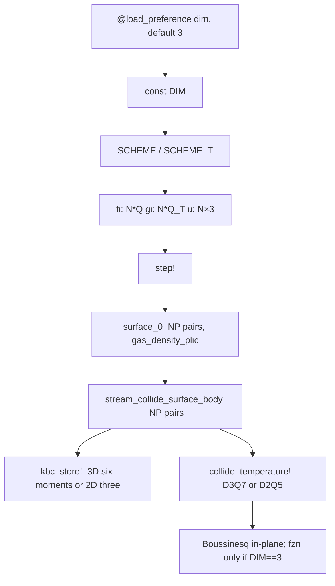
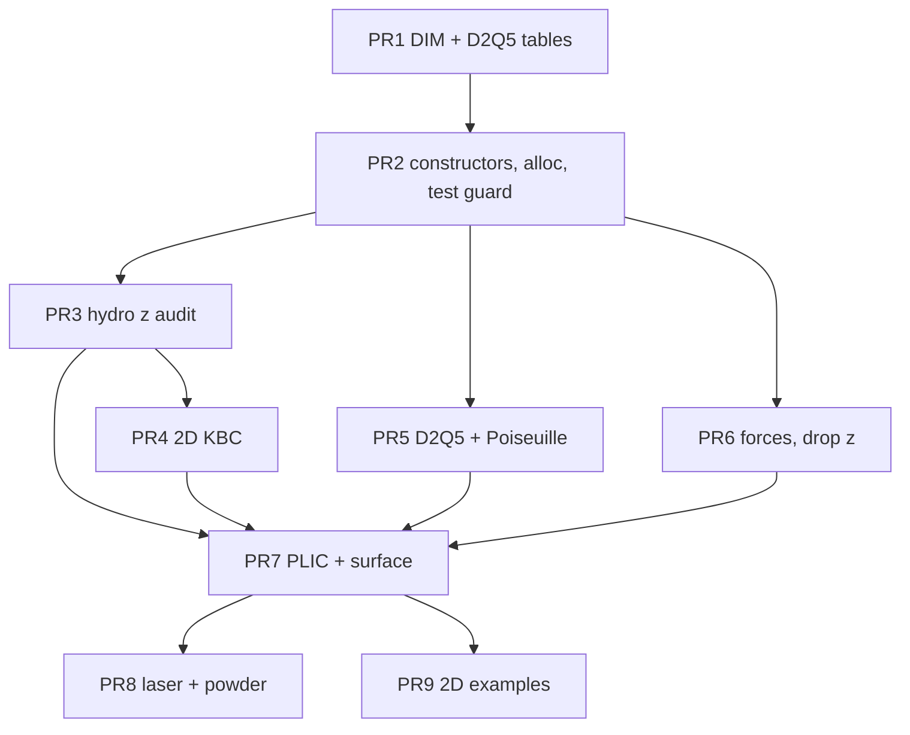

# Compile-time 2D/3D LatticeBoltzmann

| | |
|---|---|
| Author | [Author] |
| Date | 2026-10-01 |
| Status | Draft |
| Branch | `multi-material` |
| Repo | `/home/johann/.julia/dev/LatticeBoltzmann` |

## Overview

LatticeBoltzmann.jl is a single-array EsotericPull lattice Boltzmann solver. Every hot kernel is specialized with `const` flags and `@static if` (`TRT`, `KBC`, `SURFACE`, `TEMPERATURE`, … in `src/extensions.jl`). The lattice itself is not: hydro is D3Q19 (19 floats per cell) and heat is D3Q7 (7 floats), and both are baked into allocation sites and a handful of axis loops. A runtime `if` around those loops, or an `Nz == 1` grid that still stores 19 populations, does not change how many bytes move.

This design adds one more compile-time integer, `const DIM ∈ {2, 3}`, default 3, loaded with Preferences.jl `@load_preference` so the value is part of the native-code key. `DIM == 3` keeps today's lattices, formulas, and examples. `DIM == 2` allocates D2Q9 hydro and D2Q5 heat, requires `Nz == 1`, and deletes z-links and the z-only moment basis from the compiled kernel. One process is one dimension. Existing files under `examples/` are not edited. There is no foam solver on this branch (`src/` has no foam/dissolved-gas code); none is added.

On a 1024² grid the population footprint drops from 104 MiB to 56 MiB of Float32, and each hydro step stops moving 80 MiB of `fi` that a one-layer D3Q19 grid would still read and write. That is the reason for a compiler flag.

## Background & Motivation

### What is already compile-time

`src/extensions.jl` lines 4–16 are `const` switches. `APPLY_FORCE` and `UPDATE_FIELDS` are derived from them. Kernels branch with `@static if TRT`, `@static if KBC`, `@static if TEMPERATURE`. Julia deletes the dead arm before LLVM, which is why those switches are free. `DIM` belongs next to them, not in a runtime `Nz` test.

The package root includes that file before any kernel (`src/LatticeBoltzmann.jl` lines 11–12) and exports the flags. `DIM` is exported from the same place.

### What is already Q-generic

Hydro storage is `N * length(WEIGHTS[scheme])` (`src/domain.jl` lines 151 and 169). The EsotericPull pair helpers are not 19-specific:

```7:11:src/kernels/helper.jl
@inline function src_index(x, y, z, cx, cy, cz, Nx, Ny, Nz)
    wrap_coord(x, cx, Nx) + 
    wrap_coord(y, cy, Ny) * Nx + 
    wrap_coord(z, cz, Nz) * Nx * Ny + 1
end
```

`wrap_coord` (`src/kernels/helper.jl` lines 1–5) returns the coordinate unchanged when the velocity component is 0. Indexing stays `n = x + y*Nx + z*Nx*Ny + 1` with `Nz = 1` in 2D. When `cz = 0`, `src_index` does not touch another z-plane. `load_pair` / `store_pair` (`src/kernels/helper.jl` lines 13–54) only swap the two slots of pair `(i, i+1)`. `NP = (Q - 1) ÷ 2` is the only Q dependence. Do not rewrite them.

The production collide is `stream_collide_surface_body!` (`src/kernels/collide.jl` lines 411–615). `SURFACE` is `true` (`src/extensions.jl` line 7), so this is the kernel `step!` runs. It already pulls pairs with `ntuple(Val(NP))` (lines 444–452) and calls `kbc_store!` when `KBC` is true (lines 585–587). D2Q9 has `NP = 4`. That loop is the 2D hydro body.

The other `stream_collide_body!` (`src/kernels/collide.jl` lines 135–375) is specialized on `NTuple{19}` and exists only inside `@static if !SURFACE` (the block starts at line 3). It is fully unrolled D3Q19 and has no KBC. It must stay source-identical and must not be copied down to 9 velocities. At `DIM == 2`, `Q = 9`, so that method is not dispatched. The generic `!SURFACE` body (lines 6–133) is the fallback and is already an `NP` loop.

`initialize_body!` does **not** hardcode 19. It builds `flagsj` with `ntuple(Val(Q - 1))` and scans `for k in 1:(Q - 1)` (`src/kernels/init.jl` lines 100–114). The same scan in `average_neighbors_*` is `for i in 2:Q` (lines 12, 34, 56, 73). The `!SURFACE` init kernel does the same (lines 208 and 229). Once `model.velocities` is the D2Q9 tuple, a z-neighbor is not in the set. No second neighbor list is added.

`surface_0_body!` mass flux is the same pair loop (`src/kernels/surface.jl` lines 54–67 and 162–192). It stays.

### What is not Q-generic

These sites assume 3D and are the actual work:

| Site | Where | Why 2D cannot reuse it |
|---|---|---|
| `gi` allocation | `src/domain.jl` line 203, `N * 7` | D2Q5 has 5 populations. Index 6 is out of range. |
| `ω_T` | `src/domain.jl` lines 198–200, `omega_T_from_alpha` at `src/kernels/temperature.jl` lines 249–250 | D3Q7 map. D2Q5 `cs²` is 1/3, not 1/4. |
| Thermal axes | `src/kernels/temperature.jl` lines 272–278, 363–386, 397–406; `src/kernels/moments.jl` lines 77–84 | `store_pair!` sites hardcode pairs 2, 4, and **6**. |
| `store_geq_local!` | `src/kernels/temperature.jl` lines 14–20, called from `src/kernels/init.jl` lines 139–140 | Scalar loop `for i in 2:7`, one population at a time. Not a pair store. `initialize!` is out of bounds on a length-`5N` `gi` until the loop is `2:5`. |
| `geq` and the `Q` source | `src/kernels/temperature.jl` lines 5–9 and 374–385 | Weights 1/4 and 1/8, source coefficients 0.25 and 0.125. |
| KBC shear | `src/kernels/hydro.jl` lines 160–170 and 181–198 | Six moments. `qzz = cz² − 1/3` has weight sum `−1/3` on D2Q9, so it is not orthogonal to mass. `Πzz` accumulated from D2Q9 velocities is 0 (line 195, every `cz` is 0), so today's call does not move mass. 2D still drops `Πzz`, `Πxz`, `Πyz` so a nonzero `Πzz` cannot enter. |
| Laplace jump | `src/plic.jl` lines 207–212 | `1 − 6σκ` is the 3D jump `Δp = 2σκ`. |
| PLIC neighborhood | `gather_phi_d3q27`, `calculate_normal_py`, `plic_cube` (`src/plic.jl` lines 29–82, 118–129, 131–205) | 3³ cube and a paraboloid. 2D is a 3×3 and a line. |
| z derivatives | `marangoni_force`, `recoil_force` (`src/kernels/forces.jl` lines 12–13 and 64–65); `flux_neighbor_T` (`src/kernels/temperature.jl` lines 124–132) | `(0,0,±1)` on `Nz = 1` is the same cell. |
| Mass-excess recipients | `src/domain.jl` lines 395–396 | Hardcoded `VELOCITIES[:D3Q19]`, unlike init. |
| Laser / powder hit | `plic_hit` (`src/laser.jl` lines 133–154), called at line 226 and at `src/powder.jl` lines 195–196 after `gather_phi_d3q27` | `phij` is untyped. The body always calls `calculate_normal_py` (`NTuple{27}`, `src/plic.jl` line 29) and `plic_cube`. A 9-neighborhood needs its own method. |
| Powder bed | `paint_powder_bed!` (`src/powderbed.jl` lines 51–69) | HDF5 volume. Must error in 2D, not slice. |

`:D2Q9` already exists in `src/weights.jl` lines 2–6 and `src/velocities.jl` lines 12–22, with a zero z component. `:D2Q5` does not exist. `:D3Q27` is the PLIC stencil (`src/plic.jl` line 3), not a hydro scheme.

### Bandwidth, not a slogan

Populations are direction-major. `f_index(n, i, N) = n + (i - 1) * N` (`src/memory.jl` lines 10). Velocity `i` is one contiguous slab of `N` floats. EsotericPull streaming keeps a single `fi`: on even steps `load_pair(..., Val{false})` reads slot `i+1` at the cell and slot `i` at the upwind cell; on odd steps it swaps (`src/kernels/helper.jl` lines 13–21). `store_pair!` writes the post-collision values into the opposite slots (lines 24–32) so the next step pulls from the neighbor without a second distribution array. That is one read and one write of every population per hydro step. A two-array pull would be the same traffic plus a second buffer. A push would write scattered neighbor locations instead of swapping slots. None of those layouts change the byte count, which is `2 * Q * sizeof(SType)` per cell per hydro step.

Default `SType` is Float32 (`src/model.jl` line 199). Per cell:

| Array | Lattice | Populations | Bytes |
|---|---|---|---|
| `fi` | D3Q19 | 19 | 76 |
| `fi` | D2Q9 | 9 | 36 |
| `gi` | D3Q7 | 7 | 28 |
| `gi` | D2Q5 | 5 | 20 |

`u` and `F` stay `(N, 3)` (`src/domain.jl` lines 163–167): 12 bytes/cell either way.

A 1024² grid has `N = 1024 * 1024 = 1_048_576 = 2^20` cells.

- `fi`: `2^20 * 76 = 79_691_776` bytes = **76 MiB**, versus `2^20 * 36` = **36 MiB**. Delta **40 MiB**.
- `gi`: `2^20 * 28` = **28 MiB**, versus `2^20 * 20` = **20 MiB**. Delta **8 MiB**.
- Population resident set: **104 MiB → 56 MiB**. A D3Q19+D3Q7 grid with `Nz = 1` leaves **48 MiB** on the table.
- EsotericPull traffic per hydro step, `fi` only (read + write): **152 MiB → 72 MiB**. Saved **80 MiB/step**. Ratio `19/9 ≈ 2.11`.
- `gi` is collided on the thermal substep, not on every hydro substep (`step!` sets `thermal = sub == nsub`, `src/model.jl` lines 667–670). Its traffic is **56 MiB → 40 MiB** per outer step. `n_hydro > 1` multiplies the `fi` term, not `gi`.

Packing `u` from 3 components to 2 saves `2^20 * 4` = **4 MiB** on that grid, which is `4/48 ≈ 8%` of the population delta, and it forks every `u[n, 3]` site (`src/memory.jl` lines 106–114 already special-cases `ndims == 2`). Out of scope. `uz` is stored and forced to 0.

A runtime branch inside a kernel that still allocates 19 slabs moves 152 MiB/step anyway. It also keeps both arms in the native function, so LLVM will not drop the z slabs or unroll a fixed `NP = 4`. `@static if DIM == 2` makes `Q` a constant: the 2D image has 9 `fi` slabs and 5 `gi` slabs, and the z index arithmetic is not emitted.

Float64 `SType` doubles every number above. The ratio does not change.

## Goals & Non-Goals

### Goals

- `const DIM` is 2 or 3 for the whole process. Default is 3 with no preference file, so current examples and `test/runtests.jl` stay 3D with no edit.
- `DIM == 3` kernels stay source-identical inside `@static if DIM == 3` wherever the formula changes (KBC, heat, PLIC, Laplace). Not "refactored and equivalent".
- `DIM == 2` hydro is D2Q9, heat is D2Q5, `Nz == 1`, `Dz == 1`. `u` stays `(N, 3)` with `uz = 0`.
- Constructors, allocation, KBC basis, thermal `ω(α)`, z-derivatives, PLIC, and the laser/powder walk follow that flag.
- `DIM == 3` tests pass after every PR. Tests that need both dimensions are two Julia processes.

### Non-goals

- Do not edit existing `examples/*.jl`. Do not turn `dam_break.jl`, `channel.jl`, `melt_pool.jl`, `DED.jl`, or `LPBF.jl` into 2D. New 2D examples are new files, last, and only three: `examples/channel_2d.jl`, `examples/lid_driven_cavity_2d.jl`, `examples/dam_break_2d.jl`.
- Do not change 3D numerical results.
- No runtime dimension switch, no dual lattice in one process, no `u` packed to 2 components, no IBM, no new physics.
- No foam port. This branch has no foam solver.
- Do not retune TRT `Λ = 3/16` (`omega_minus`, `src/kernels/hydro.jl` lines 29–31). Do not change `lbm_α` (`src/units.jl` lines 67–68). Callers keep passing the same `domain.α` they pass today. Only the map from that number to `ω_T` changes in 2D.
- Do not rewrite `attach`, `MemoryContainer`, or EsotericPull load/store. `Dz` is already the local `UInt(1)` at `src/model.jl` lines 239–241. Forcing it to stay 1 is enough.
- Do not add a second VTK format.

## Proposed Design

### Flag and precompile key

`Project.toml` gains one dependency: Preferences.jl, uuid `21216c6a-2e73-6563-6e65-726566657250` (the copy already in the depot is 1.5.2), compat `"1"`. Julia is already `1.10.10`.

```julia
using Preferences
# @load_preference records the key via Base.record_compiletime_preference
# while precompiling (Preferences.jl src/Preferences.jl lines 39–41).
# Do not pass disable_invalidation=true: a const would then survive a
# preference change (Preferences.jl docstring, lines 28–30).
_dim_pref = @load_preference("dim", 3)
_dim_pref isa Integer || error("LatticeBoltzmann dim preference must be an Int, got $(typeof(_dim_pref))")
const DIM = Int(_dim_pref)
DIM == 2 || DIM == 3 || error("LatticeBoltzmann DIM must be 2 or 3, got $DIM")

@static if DIM == 2
    const SCHEME   = :D2Q9
    const SCHEME_T = :D2Q5
else
    const SCHEME   = :D3Q19
    const SCHEME_T = :D3Q7
end
```

This lives at the top of `src/extensions.jl`, and `src/LatticeBoltzmann.jl` exports `DIM`, `SCHEME`, `SCHEME_T` next to the other flags (line 12).

`@load_preference("dim", 3)` with no `LocalPreferences.toml` evaluates to 3. During `Pkg.precompile`, `load_preference` sees `currently_compiling()` and calls `Base.record_compiletime_preference(uuid, "dim")`. Julia's cache staleness check includes that preference. Changing it makes the `.ji` stale, the module body runs again, and `const DIM` is rebound. A running session does not notice; the next process does.

`.gitignore` gains `/LocalPreferences.toml`. It is not committed. The default build has no preference file.

The two-process invocation is a comment in `extensions.jl`, not a new markdown file in the repo:

```julia
# One process is one DIM. Absent preference => 3.
# 2D, from this project, then restart Julia:
#   using Preferences
#   set_preferences!("LatticeBoltzmann", "dim" => 2; force=true)
#   # writes gitignored LocalPreferences.toml; next process recompiles
# Delete that file to return to 3. Do not read ENV. Do not pass
# disable_invalidation=true. 3D tests and 2D tests are two processes.
```

CI should prefer a temporary depot/project that `Pkg.develop`s this repo and sets the preference there, so the job does not leave `dim = 2` in a developer's working tree. The 2D job is an ordinary `Pkg.test()` after that, **not** `julia --compiled-modules=no`. The no-cache flag would still bind `DIM` (the module body runs) but would not exercise `record_compiletime_preference`. The job asserts `DIM == 2`, then a third process with the preference removed asserts `DIM == 3`.

Rejected in the same breath: `const DIM = parse(Int, get(ENV, "LBM_DIM", "3"))`. The `.ji` stores the const from the process that precompiled. `LBM_DIM` is not in the cache key. The next process loads the image and never re-runs the module body. It silently runs the other dimension.

### Lattices

`SVector{3,Int}` stays the velocity type. D2Q9 already stores `z = 0` (`src/velocities.jl` lines 13–21). D2Q5 uses the same pair order as the first two axes of D3Q7 (`src/velocities.jl` lines 23–31), which is also the order `collide_temperature!` already uses for x and y (pair indices 2 and 4):

```julia
:D2Q5 => SVector{3,Int}[
    SVector( 0,  0,  0),
    SVector( 1,  0,  0),
    SVector(-1,  0,  0),
    SVector( 0,  1,  0),
    SVector( 0, -1,  0),
]
```

Weights, sum 1: rest `1//3`, each axis `1//6`. Then `Σ_i w_i c_{ix}^2 = 2 * (1//6) = 1//3`, so `cs² = 1/3`. There is no z link, so there is no population 6 and `NP = 2`.

D2Q9 weights are unchanged (`4//9`, `1//9`, `1//36`). `cs² = 1/3` there as well. D3Q19 is the same `cs²`. D3Q7 is not: rest `1//4`, axis `1//8`, `cs² = 1/4` (`src/weights.jl` lines 7–10).

`src/units.jl` needs no formula change. `si_p` divides by 3 (line 45) because hydrodynamic `cs² = 1/3`, which is correct for both D2Q9 and D3Q19. The comment on line 21 that says "for D3Q19" is updated to "for D2Q9 and D3Q19" so nobody "fixes" `si_p` later. `lbm_α` stays a unit conversion of the number the caller already passes. `units.jl` is not where `ω_T` is defined.

Velocity arrays stay `(N, 3)`. Every 2D kernel that would write `uz` writes `0`. `export!` keeps the third VTK component; it is zeros (`src/export.jl` lines 84–86 and 249–252).

### Constructors and allocation

`Model(Nx, Ny, Nz, ν; scheme = :D3Q19, ...)` (`src/model.jl` lines 164–204) and the SI wrapper (`lines 71–162`, default `scheme = :D3Q19` at line 107) keep that signature. Behavior:

- `DIM == 3`: `scheme` is whatever the caller passed, default `:D3Q19`. `Nz == 1` remains legal (a 3D slab of D3Q19). Do not throw.
- `DIM == 2`: require `Int(Nz) == 1` or `throw(ArgumentError)`. The local `Dz` (line 241) is asserted `== 1`. `scheme` is forced to `:D2Q9`. The historical default `:D3Q19` is rewritten to `:D2Q9` without throwing, so a call that only sets `Nz = 1` works. Any other symbol throws. `fz` is set to 0 and a `@warn` fires if the caller passed a nonzero `gz` / `fz` ("DIM=2 ignores gz; use gy for in-plane gravity"). Kernel-side z rejection still happens; the constructor zero is so a missed site cannot accelerate `uz`.

`SCHEME_T` is not a `Model` field. Heat is not a user-selectable scheme. `DIM == 3` means `:D3Q7`. `DIM == 2` means `:D2Q5`. Temperature must not keep assuming 7 populations.

`Domain` (`src/domain.jl` line 203) becomes:

```julia
@static if DIM == 3
    gi = Memory(AT{SType}(undef, N * 7))
else
    gi = Memory(AT{SType}(undef, N * 5))
end
```

The 3D line stays the current source. `fi` is already `N * nvel` with `nvel = length(WEIGHTS[scheme])` (lines 151, 169). At `DIM == 3` and `:D3Q19` that is still 19. The struct parameter `Q` on `Model` (`src/model.jl` line 10) is inferred from `NTuple` length (`line 207`, `weights(scheme)`). No memory-container rewrite. `attach` (`src/memory.jl` lines 51–64) already takes `Nz`.

`get_N` (`src/domain.jl` line 281, `src/model.jl` line 469) stays `Nx*Ny*Nz`. With `Nz = 1` it is the 2D cell count.

### Hydro: what is shared, what is zeroed

`omega_from_nu` (`src/kernels/hydro.jl` lines 281–283) is `1 / (3ν + 1/2)`. `Domain`'s own `ω` uses the same expression (lines 155–157). Both D2Q9 and D3Q19 have `cs² = 1/3`, so `ν = cs² (τ − 1/2)` is unchanged. `feq` (lines 1–4) and Guo (lines 34–42, the factors 3 and 9) are unchanged. `prescribed_hydro` (lines 78–99) is unchanged in 3D.

`@static` is added only where a z term survives `cz = 0`:

1. `uu = 1.5*(ux²+uy²+uz²)` (`src/kernels/hydro.jl` line 106, and the collide bodies). A nonzero `uz` still changes the equilibrium energy when every `cz` is 0. After the moment sum, `DIM == 2` sets `uz = 0` before `uu` is formed.
2. The half-force shift `uz += fzn * invρ * 0.5` (`src/kernels/collide.jl` lines 91–94 and 547–550). `fz` is a scalar, not a lattice link. `DIM == 2` sets `fzn = 0` and `uz = 0`. The three existing 3D assignment lines are not edited; the 2D zero is an extra `@static if DIM == 2` arm after them, deleted from the 3D image.
3. Non-thermal Boussinesq, the `else` of `do_thermal` in `stream_collide_surface_body!` only (`src/kernels/collide.jl` lines 520–525). `step!` takes this arm when `n_hydro > 1` and `sub != nsub` (`src/model.jl` lines 667–670). The block is

```julia
          else
            dT = T[n] - T_avg
            fxn -= fx * β * dT
            fyn -= fy * β * dT
            fzn -= fz * β * dT
          end
```

Both images keep the `else` (line 520), `dT`, `fxn`, and `fyn` (lines 521–523). Only line 524, `fzn -= fz * β * dT`, is inside `@static if DIM == 3`. The `end` at line 525 stays outside that arm and still closes `if do_thermal`. Pasting lines 520–524 as a whole into `@static if DIM == 3` deletes the in-plane updates from the 2D image. Julia accepts `if do_thermal` with no `else`, so that mistake compiles and is silent. Poiseuille uses default `β = 0` and will not catch it. The thermal substep's Boussinesq is a different site, inside `collide_temperature!` (lines 389–393); PR 5 drops only its `fzn` line. The generic `!SURFACE` body (lines 74–80) and the `NTuple{19}` body (lines 241–246) have no `do_thermal` else. They are not given this split. The `NTuple{19}` method stays untouched. If a non-thermal buoyancy arm is later added to the generic body, the same rule applies: `dT`, `fxn`, and `fyn` in both dimensions, and only the `fzn` assignment under `DIM == 3`.
4. `prescribed_hydro`'s `uz` clamp (`src/kernels/hydro.jl` lines 92 and 96). Same pattern: 2D stores 0.
5. `initialize_body!` writes `u[n, 3] = uz` from the caller (`src/kernels/init.jl` line 120). 2D stores 0 before `store_feq!`. The neighbor scan is left as the `Q` loop.

The `NP` loops in `stream_collide_surface_body!`, the generic `!SURFACE` body, `store_feq!`, and `surface_0_body!` are not duplicated. The unrolled `NTuple{19}` body is not modified and is not used as the 2D template.

`moments_body!` writes `u[n, 3]` (`src/kernels/moments.jl` lines 70–74) only when it does not return early. `UPDATE_FIELDS = SURFACE` (`src/extensions.jl` line 15) and `SURFACE` is true, so the default build returns at lines 39–41 and never reaches that store. The 2D zero is still added on that store so a `SURFACE = false` build cannot publish a nonzero `uz`. That edit sits with the thermal-moment fix in PR 5, in the same function, so PR 3 does not have to touch `moments.jl`.

### KBC

`kbc_shear` (`src/kernels/hydro.jl` lines 160–170) builds

```text
qαα = cα² − 1/3
s_i = w_i * (9/2) * (qxx Πxx + qyy Πyy + qzz Πzz + 2 cx cy Πxy + 2 cx cz Πxz + 2 cy cz Πyz)
```

On D2Q9 every velocity has `cz = 0`, so `Σ_i w_i (cz² − 1/3) = Σ_i w_i (−1/3) = −1/3 ≠ 0`. The polynomial `qzz` is not orthogonal to mass. That is not the same statement as "today's operator moves mass." `kbc_store!` accumulates `Πzz += dp*cz² + dm*cz²` (`src/kernels/hydro.jl` line 195). Every `cz` in `VELOCITIES[:D2Q9]` is 0, so `Πzz`, `Πxz`, and `Πyz` come out 0, and

```text
Σ_i s_i = Σ_i w_i * (9/2) * qzz * Πzz = (9/2) * Πzz * Σ_i w_i (cz² − 1/3) = −(9/2) Πzz / 3
```

is 0. A `kbc_shear` call whose moments were accumulated from a real D2Q9 pair set is numerically the in-plane operator. The leak is a nonzero `Πzz` passed in while `cz = 0`: then `Σ_i s_i = −(9/2) Πzz / 3 ≠ 0` and mass moves. 2D therefore does not call `kbc_shear` and does not store `Πzz`, `Πxz`, or `Πyz`. Poiseuille does not wait on PR 4 for this reason (`KBC == true` on D2Q9 populations already conserves mass). The split still lands, so the non-orthogonal basis is not left in the 2D image for a later edit to feed.

The in-plane pieces are already orthogonal to mass on D2Q9. For `qxx = cx² − 1/3` and the weights in `src/weights.jl` lines 2–6:

- rest: `(4/9)*(−1/3) = −4/27`
- ±x: `2*(1/9)*(2/3) = 4/27`
- ±y: `2*(1/9)*(−1/3) = −2/27`
- four diagonals: `4*(1/36)*(2/3) = 2/27`

Sum is 0. Same for `qyy`. `Σ w_i cx cy = 0` by symmetry. So the 2D shear population is

```julia
@inline function kbc_shear_2d(wi::CType, cx::CType, cy::CType,
                              Πxx::CType, Πyy::CType, Πxy::CType) where {CType}
    third = CType(1) / CType(3)
    qxx = cx * cx - third
    qyy = cy * cy - third
    contr = qxx * Πxx + qyy * Πyy + CType(2) * cx * cy * Πxy
    return wi * CType(4.5) * contr
end
```

`kbc_store!` (`src/kernels/hydro.jl` lines 174–268) is split:

- `@static if DIM == 3`: the current function body, lines 180–267, pasted with no edit. It still accumulates six moments and still calls `kbc_shear`.
- `else`: a `kbc_store!` with the same signature so the call at `src/kernels/collide.jl` line 586 is not touched. It accumulates only `Πxx`, `Πyy`, `Πxy` over the `NP` pairs, calls `kbc_shear_2d`, and does not mention `Πzz`.

`kbc_hperp` (lines 270–273) stays one function. The projector `w_i (m0 + 3 (mx cx + my cy + mz cz))` uses `1/cs² = 3`, which is right for D2Q9, and `cz = 0` makes the `mz` term zero. `kbc_gamma` (lines 275–279) is unchanged.

The 2D unit test, compiled only when `DIM == 2`, does not `step!`. Two checks:

1. Populations. Build a non-equilibrium D2Q9 pair set and run the 2D `kbc_store!`. Also evaluate `kbc_shear` on the moments that function would store if it still accumulated `Πzz` from those same velocities (`cz = 0`). Expect `Πzz == 0`, `Πxz == 0`, `Πyz == 0`, and `Σ s_i == 0` and `Σ c_α s_i == 0` for both formulas.
2. Injected moment. Call `kbc_shear` with `cz = 0`, `Πzz ≠ 0`, and `Πxx = Πyy = Πxy = Πxz = Πyz = 0`. Expect `Σ_i s_i = −(9/2) Πzz / 3`. This is the negative check. It is not "any `cz = 0` call on a pair set gives `Σ s_i ≠ 0`."

An algebraic check `sum(w * (0 - 1/3) for w in WEIGHTS[:D2Q9]) == -1/3` lives in `test/test_weights.jl` and runs in both processes; it does not call the kernel.

### Heat: D2Q5 is a different omega

`domain.α` means model-α `= 2χ`, with Fourier `k = χ = α/2`. That meaning is kept. The D3Q7 comments at `src/domain.jl` lines 303–306 and `src/kernels/temperature.jl` lines 1–4 are the 3D arm only.

Chapman–Enskog: `χ = cs² (1/ω − 1/2)`.

D3Q7, `cs² = 1/4`:

```text
χ = (1/4) (1/ω − 1/2)
α = 2χ  ⇒  1/ω = 2α + 1/2
ω_T = 1 / (2α + 1/2)
k = α/2 = (1/4) (1/ω − 1/2)
```

That is `omega_T_from_alpha` (temperature.jl lines 249–250), `thermal_conductivity` (lines 96–98), `Domain`'s initializer (domain.jl lines 198–200), and `thermal_k` (domain.jl lines 303–304). Those expressions stay, inside `@static if DIM == 3`.

D2Q5, `cs² = 1/3`, weights rest `1/3`, axis `1/6`:

```text
χ = (1/3) (1/ω − 1/2)
α = 2χ  ⇒  1/ω − 1/2 = (3/2) α  ⇒  1/ω = (3/2) α + 1/2
ω_T = 1 / ((3/2) α + 1/2)
k = α/2 = (1/3) (1/ω − 1/2)
```

Do not feed a D2Q5 `ω` through the D3Q7 inverter. `0.25 * (1/ω − 1/2)` would be `0.25 * 1.5 * α = 0.375 α`, not `α/2`. Robin `kT` (`robin_wall_T`, temperature.jl lines 30–36) and the TYPE_H reconstruction both call `thermal_conductivity`, so the inverter and the conductivity move together.

`thermal_k_s` / `thermal_k_l` (`domain.jl` lines 307–308) are `0.5 * α_s` and `0.5 * α_l`. They do not go through `cs²`. They stay.

Equilibrium and the volumetric source are the D3Q7 weights today:

```5:9:src/kernels/temperature.jl
@inline function geq_T_rest(Tn::CType) where {CType}
    return CType(0.25) * Tn - CType(0.25)
end
@inline function geq_T_axis(Tn::CType, ucomp::CType) where {CType}
    return CType(0.5) * Tn * ucomp + CType(0.125) * (Tn - one(CType))
end
```

`g' = g − w`, `T = 1 + Σ g`. With `w0 = 1/4`, `w = 1/8`, `1/cs² = 4`:

```text
g0 = (1/4) (T − 1)
g_axis = (1/8) (T − 1) + (1/2) T u_comp
```

The collide source (lines 374–385) adds `Δg` for `ΔT = Q`: rest `0.25 * Q`, axis `0.5 * Q * u_comp + 0.125 * Q`. That is `w_i Q + (w_i / cs²) Q (c·u)`, and `Σ Δg = Q`.

D2Q5, `w0 = 1/3`, `w = 1/6`, `1/cs² = 3`:

```text
g0     = (1/3) (T − 1)
g_axis = (1/6) (T − 1) + (1/2) T u_comp
Δg0    = Q / 3
Δg_axis = Q / 6 + (Q * u_comp) / 2
```

`Σ Δg = Q` still. The constants `0.25` and `0.125` must not appear in the 2D arm.

`collide_temperature!` (lines 260–395), `store_geq!` (lines 397–408), `store_geq_local!` (lines 14–21), `reconstruct_g_boundaries!` (lines 45–46, the triple `(2,±x), (4,±y), (6,±z)`), and `flux_neighbor_T` (lines 100–134) are split. The `DIM == 3` arm is the current source. The `DIM == 2` arm:

- At `store_pair!` sites only, pair indices 2 and 4. That is `collide_temperature!` (loads at lines 276–278, stores at 369–386), `store_geq!` (lines 404–406), and `reconstruct_g_boundaries!` (the axis list at lines 45–46). Pair 2 writes populations 2 and 3. Pair 4 writes populations 4 and 5. There is no pair 6 and no `src_index` with `(0, 0, ±1)`.
- `store_geq_local!` does not call `store_pair!`. It writes one population per index (`src/kernels/temperature.jl` lines 14–20):

```julia
@inbounds for i in 2:7
    gi[f_index(n, i, N)] = eltype(gi)(gax)
end
```

  The 2D loop is `for i in 2:5`. Restricting this loop to "pairs 2 and 4" leaves populations 3 and 5 at the allocation fill of 0. `initialize_body!` calls it for every `TYPE_S` cell (`src/kernels/init.jl` lines 139–140), which includes the Poiseuille walls. At `T = 1`, `geq` is 0, so a wall at lattice `Tm` hides the hole. At any other wall temperature the minus directions are wrong. A literal `2:7` is out of bounds: `f_index(n, 6, N) = n + 5N` and `gi` has length `5N` (last valid index `5N`, population `i = 5`). `initialize!` is out of bounds on a 5-population `gi` until this loop lands, not only `step!`.
- uses the D2Q5 `geq` and source coefficients
- applies Boussinesq to `fxn` and `fyn` only (`collide_temperature!` lines 391–393; line 393, `fzn -= fz * β * dT`, is `DIM == 3` only). This is the thermal-substep copy. The non-thermal `else` in `collide.jl` is PR 3 and is not pasted here.
- `flux_neighbor_T` walks only ±x and ±y

`moments_body!` temperature sum (lines 75–85) is the same split. It is off the default hot path (`UPDATE_FIELDS` returns at line 39) but it indexes population 6, which is out of bounds once `gi` has length `5N`. `f_index(n, 6, N) = n + 5N`. The allocation is `5N` long; the last valid index is `5N` (`i = 5`). `i = 6` is always past the end.

`step!` does not scale `α` when it scales `ν` by `1/n_hydro` (`src/model.jl` lines 646–654). That is pre-existing and stays. The new `ω_T(α)` consumes the same `domain.α` the D3Q7 map consumes. Do not also multiply `α` by `3/2` at the call site.

### Why z must be compiled out, with the index

`Nz = 1`, zero-based coordinates, `Nx = 10`, `Ny = 8`, cell `(x, y, z) = (4, 2, 0)`:

```text
n = 4 + 2*10 + 0*80 + 1 = 25
```

`src_index` for `(cx,cy,cz) = (0,0,+1)`: `z == 0 == Nz − 1`, so `wrap_coord` returns 0 (`src/kernels/helper.jl` lines 1–5). The source is `n = 25`. `(0,0,−1)` hits the `z == 0` wrap and also returns 0. Both z-neighbors are the cell itself.

`axis_deriv` (`src/kernels/forces.jl` lines 76–88) then computes `0.5*(T[25] − T[25]) = 0` when both aliases pass `is_thermal_liquid`. The slope happens to be zero. That is not a reason to keep the load. `flux_neighbor_T` does not cancel: if the cell is `TYPE_S`, both the `+z` and the `−z` tests (`temperature.jl` lines 124–132) see `TYPE_S` on `flags[25]` and each adds `T[25]`. One wall cell is counted twice as its own neighbor. `reconstruct_g_boundaries!` on pair 6 both reads a missing population and treats that self-neighbor as a missing solid. 2D deletes those loads. It does not rely on the centered difference being zero.

`marangoni_force` (lines 4–31) and `recoil_force` (lines 50–74) get a `DIM == 2` arm that does not sample `zp`/`zm`, sets `dTz = 0`, `dϕz = 0`, and returns a zero z component. The in-plane normal and the tangent projection stay. `darcy_force` (lines 33–46) multiplies `uz`; once `uz` is 0 the z drag is 0. No neighbor load, no fork beyond what the caller already did to `uz`.

### Free surface and PLIC

`gas_density_plic` (`src/plic.jl` lines 207–212):

```207:212:src/plic.jl
@inline function gas_density_plic(σ::T, ϕ, ϕ0::T, x, y, z, Nx, Ny, Nz) where {T}
    σ == zero(T) && return one(T)
    phij = gather_phi_d3q27(ϕ, ϕ0, x, y, z, Nx, Ny, Nz)
    κ = calculate_curvature(phij)
    # 6σκ > 1 makes ρ_g ≤ 0 and feq invalid. Floor (and cap) the jump.
    return clamp(one(T) - T(6) * σ * κ, T(0.2), T(2))
end
```

3D: Young–Laplace `Δp = 2 σ κ` with `κ` the mean curvature `(κ1+κ2)/2` that `calculate_curvature` returns (the `1/2` is already in the paraboloid formula at line 202; see the reduction under Data Model). `Δρ = Δp / cs² = 3 Δp = 6 σ κ` because `cs² = 1/3`. Clamp of `κ` is `[−1, 1]` (line 204). Clamp of `ρ_g` is `[0.2, 2]` (line 212). Both clamps stay.

2D: one radius, `Δp = σ κ`, `Δρ = 3 σ κ`. `κ` here is the curvature of the curve, `dθ/ds`, not a mean curvature and not `κ/2`. Using the 3D fitter and also changing 6 to 3 would apply the factor twice or not at all. The 2D function returns geometric curvature, and the jump uses 3:

```julia
return clamp(one(T) - T(3) * σ * κ, T(0.2), T(2))
```

`σ == 0` still returns 1 without a gather.

Neighborhood. D2Q9 is the 3×3 Moore stencil, z = 0, in this order (`src/velocities.jl` lines 13–21):

| i | c | role |
|---|---|---|
| 1 | (0,0) | center |
| 2, 3 | (±1,0) | E, W |
| 4, 5 | (0,±1) | N, S |
| 6, 7 | (±1,±1) paired | NE, SW |
| 8, 9 | (1,−1), (−1,1) | SE, NW |

`gather_phi_d2q9` is `gather_phi_d3q27` with `VELOCITIES[:D2Q9]` and `Val(9)`. It does not read `cz`. `gather_phi_d3q27` is not called on an `Nz = 1` grid: the 27-stencil's z-neighbors alias the cell and the paraboloid fit is nonsense, not a slightly wrong κ.

Parker–Youngs in 2D is metal→gas, the same direction as `calculate_normal_py`. `src/laser.jl` line 130 says that normal "points metal to gas." The face term at `src/plic.jl` line 30 is `4*(phij[3] − phij[2])`. D3Q27 index 2 is `+x` and index 3 is `−x` (`src/velocities.jl` lines 55–56), so the face term is `4*(φ_W − φ_E)`, which is `−∇ϕ`. `_deposit_along_normal!` then steps `inx = -nx` (`src/laser.jl` line 169) to walk into the metal. A `+∇ϕ` normal sends that walk into the gas. Do not add a second deposit routine to compensate.

Term-by-term reduction of `calculate_normal_py` (`src/plic.jl` lines 30–38). Drop every link with `cz ≠ 0`, then halve the remaining weights (face 4→2, in-plane diagonal 2→1). D3Q27 in-plane links and their D2Q9 indices (`src/velocities.jl` lines 13–21 and 53–81):

| D3Q27 i | c | role | D2Q9 i |
|---|---|---|---|
| 2, 3 | (±1,0,0) | E, W | 2, 3 |
| 4, 5 | (0,±1,0) | N, S | 4, 5 |
| 8, 9 | (1,1,0), (−1,−1,0) | NE, SW | 6, 7 |
| 14, 15 | (1,−1,0), (−1,1,0) | SE, NW | 8, 9 |

`nx`, lines 30–31, in-plane terms only, **D3Q27 indices**: face `4*(φ3−φ2)` and weight-2 diagonals `2*(φ9−φ8 + φ15−φ14)` (SW−NE and NW−SE). The other weight-2 pairs on that line are `(11,10)` and `(17,16)`, both with `cz ≠ 0`. Every corner (indices 20–27) has `cz ≠ 0`. Halved and rewritten in **D2Q9** indices (SW = 7, NE = 6, NW = 9, SE = 8):

```text
nx = 2*(φ3−φ2) + (φ7−φ6) + (φ9−φ8)
```

which is the same multiset as `2*(φ3−φ2) + (φ9−φ6) + (φ7−φ8)`.

`ny`, lines 33–34, in-plane terms only, **D3Q27 indices**: face `4*(φ5−φ4)` and weight-2 diagonals `2*(φ9−φ8 + φ14−φ15)` (SW−NE and SE−NW). The other weight-2 pairs are `(13,12)` and `(19,18)`, both with `cz ≠ 0`. Halved, in **D2Q9** indices:

```text
ny = 2*(φ5−φ4) + (φ7−φ6) + (φ8−φ9)
```

which is the same multiset as `2*(φ5−φ4) + (φ8−φ6) + (φ7−φ9)`.

`nz` (lines 36–38) is dropped entirely. The 2D stencil is therefore

```text
nx = 2*(φ3−φ2) + (φ9−φ6) + (φ7−φ8)
ny = 2*(φ5−φ4) + (φ8−φ6) + (φ7−φ9)
nz = 0
```

with φ indexed in the D2Q9 order above (2 = E, 3 = W, 4 = N, 5 = S, 6 = NE, 7 = SW, 8 = SE, 9 = NW). That is `−∇ϕ`. The previous draft's `2*(φ2−φ3) + (φ6−φ9) + (φ8−φ7)` is `+∇ϕ` and pairs the wrong diagonals; it is not this reduction.

Line cut, `plic_line`. The input is the unfolded fill `V0`, the same argument `plic_cube` takes (`src/plic.jl` lines 72–81). `l = |nx| + |ny|`. L1-normalize so `n1 + n2 = 1`, `n1 = min/l ≤ n2 = max/l`. Fold only the volume that enters the inverse, the assignment at line 76:

```text
V = 0.5 − abs(V0 − 0.5)
```

The α formulas run on that folded `V` (Scardovelli & Zaleski, unit-square cut):

```text
V* = n1 / (2 n2)          # area at α = n1; 0 if n1 = 0
α  = sqrt(2 n1 n2 V)      if V ≤ V*
α  = n2 * V + n1 / 2      otherwise
```

`n1 = 0` (axis-aligned) skips the square root and uses `α = V`. The return matches line 81. Line 80 is `d = plic_cube_reduced(...)`, not the return. The sign uses the unfolded `V0`:

```text
l * copysign(0.5 − α, V0 − 0.5)
```

Signing with the folded `V` is wrong: after line 76, `V − 0.5 ≤ 0` for every fill, so `plic_line(V0)` and `plic_line(1 − V0)` land on the same side of the cell. `plic_cube(0)` is negative and `plic_cube(1)` is positive, and the two offsets sum to 0 (`test/test_plic.jl` lines 14–16). `plic_hit` adds this offset into the plane (`src/laser.jl` line 145). `calculate_curvature_2d` samples `plic_line(φi) − center_offset`. A fill above one half that flips relative to `plic_cube` is a per-cell side error, not a global κ sign, so the sphere gate does not absorb it. A half-full cell still returns offset 0 (`copysign` of a zero distance; `test/test_plic.jl` lines 6–7). `test/test_plic_2d.jl` locks the same empty/full pair: offset at fill 0 is negative, offset at fill 1 is positive, and they sum to 0. A half-cell check of 0 does not replace that pair.

Curvature. Fit height along that metal→gas normal the way `calculate_curvature` fits along `bz` (`src/plic.jl` lines 132–154): `bz = calculate_normal_py_2d`, one in-plane tangent, interface cells with `0 < φ < 1` (the 3D selection, line 149), and `pz = dot(ei, bz) + (plic_line(φi, bz) − center_offset)` (the 3D form is line 154). Need at least 3 points; otherwise return 0, as `Nsol <= 0` does at line 195. Fit `h = A s² + B s + C`. Then

```text
κ = 2A / (1 + B²)^(3/2)
```

clamped to `[−1, 1]`. The jump stays `1 − 3σκ`. The liquid-disk test expects `κ > 0` (so `ρ_g < 1`) and `|κ|` within a loose tolerance of `1/R`. This is not the 5-coefficient paraboloid (`lu_solve5!`, lines 84–114) and not mean curvature.

`κ > 0` is the product sign for a liquid drop (higher liquid pressure, `ρ_g < 1`). It is not a measurement of today's fitter. `test/test_plic.jl` checks a flat interface (`|κ| < 0.15`, lines 25–27) and `σ = 0` (line 32). It does not lock drop sign, so 3D `Pkg.test()` will not catch a flipped 2D normal. A height graph along the outward normal of a liquid disk is concave, so a raw `A` from `h` measured in the `+n` direction is negative and raw `κ = 2A/(1+B²)^(3/2)` is `−1/R`. `calculate_curvature` uses the same normal direction (`bz = calculate_normal_py`, line 132) and builds `K` from the same second-derivative signs (`A` and `B` at line 202). Before coding `calculate_curvature_2d`, evaluate `calculate_curvature` on a spherical liquid blob (`φ = 1` inside, `0` outside) and record the sign. Do not implement past this gate.

- If that call returns `κ > 0`, the disk test stays `κ > 0`. Match the 3D height coordinate (line 154). Do not reverse `n`.
- If that call returns `κ < 0`, the draft's claim that the 3D fitter returns `κ > 0` for a drop is false. Stop. Do not "fix" the 2D formula by writing `κ = −2A/(1+B²)^(3/2)` while `n` still points metal→gas, and do not point `n` into the metal so that `A` flips. `_deposit_along_normal!` walks `−n` (`src/laser.jl` line 169), and `ρ_g = 1 − (3 or 6)σκ` has to use one κ sign in both dimensions. The resolution that does not move 3D results is: the disk test expects the sign `calculate_curvature` returned, and `ρ_g = clamp(1 − 3σκ, 0.2, 2)` follows, including `ρ_g > 1` when that sign is negative. Editing `calculate_curvature` or the factor 6 is out of scope.

`plic_cube`, `calculate_curvature`, and `D3Q27_C` stay compiled in both dimensions so `test/test_plic.jl` still runs under `DIM == 2`; `gas_density_plic` is the function that branches.

`surface_0_body!` keeps the pair mass flux. Under `DIM == 2` it sets `uz = uzg = 0` and does not apply `fz` (lines 137–140) or a z Marangoni/recoil component (lines 146–156). Those functions already return 0 after PR 6; the stores are still guarded so a nonzero `fz` cannot re-enter `uug`.

`_massex_recipients` (`src/domain.jl` lines 389–406) is the one surface walk that hardcodes `:D3Q19`. The `DIM == 3` arm keeps lines 395–399 verbatim. The 2D arm walks `VELOCITIES[:D2Q9]`. `metal_mass` then counts in-plane recipients only.

### Laser, powder, powder bed

`_walk_laser_ray!` (`src/laser.jl` lines 194–273) and `_walk_parcel!` (`src/powder.jl` lines 161–220) are host DDA. Both call `gather_phi_d3q27` (laser line 225, powder line 194) and step `tMaxZ` (laser lines 264–269, powder lines 210–216).

`DIM == 2` walk, x–y only:

- Cell `iz` is 1. Parcel/ray `oz` is the center of that layer, `1.0` (`floor(oz + 0.5) = 1`, faces at 0.5 and 1.5). `pz` / `pvz` fields stay on the structs; they are not repacked. The walk writes `oz = 1` and `dirz = 0`.
- Direction is projected onto xy and renormalized. A direction with no in-plane component is dropped (laser) or the parcel dies (powder).
- Hit test, in the `DIM == 2` arm of `_walk_laser_ray!` (today's call is lines 225–227) and of `_walk_parcel!` (`src/powder.jl` lines 194–196): `gather_phi_d2q9`, then a new method

```julia
plic_hit(ϕ0::T, phij::NTuple{9,T},
         ox::T, oy::T, oz::T,
         dirx::T, diry::T, dirz::T,
         cx::T, cy::T, cz::T) where {T}
```

  The new method calls `calculate_normal_py_2d(phij)` and `plic_line(ϕ0, nϕ)`, then the same plane test as lines 140–153 (`n2`, `nd`, `t`, and `|h − c| ≤ 0.5` on all three axes). `oz = 1` and `dirz = 0` make the z half of that box true for a ray that stays in the slab. They do not select which method runs. The existing method (lines 133–154) is left untouched, including its untyped `phij` (line 134). Its body still calls `calculate_normal_py` and `plic_cube`. Do not add `::NTuple{27}` to it. Specificity is pairwise across the whole signature. The old method types `ϕ0` and every trailing scalar `::T` (`src/laser.jl` lines 133–138) and leaves only `phij` untyped. A new method that types `phij::NTuple{9,T}` and leaves `ox` through `cz` untyped is ambiguous with that method: `NTuple{9,T}` is stricter on `phij`, and `::T` is stricter on the nine trailing scalars. `ϕ0::T` matches on both methods. The signature above annotates the trailing scalars `::T` as well, so it is strictly more specific. A 9-tuple selects it. A 27-tuple does not match `NTuple{9,T}` and still hits the old body. `plic_hit` does not take a normal. Each method computes one. `calculate_normal_py_2d` and `plic_line` are called only from the new method.
- `tMaxZ` is not part of `tstep`. `max_step = Nx + Ny + 16` (the `Nz` term is 1 and is noise).
- `_deposit_along_normal!` (lines 157–190) is not duplicated. It steps `inx = -nx`, `iny = -ny`, `inz = -nz` (lines 169–171). That walks into the metal only when `n` is metal→gas, which is what `calculate_normal_py_2d` returns. With `nz = 0` the walk stays in the layer. A `+∇ϕ` normal would deposit into the gas without any other change to this function.

`paint_powder_bed!` (`src/powderbed.jl` lines 51–69) under `DIM == 2` throws `ArgumentError("paint_powder_bed! is a 3D HDF5 volume; DIM=2 has no powder bed")` before the z loop. The current body is the `DIM == 3` arm, unchanged. `read_powder_bed` can still parse a file; it does not paint. `test/test_powder_bed.jl` is included only when `DIM == 3`, because it paints.

### VTK

`export!` already writes an image of size `Nx × Ny × Nz` (`src/export.jl` lines 225–226, 245–248). `zs = range(..., length = Nz)` with `Nz = 1` is a legal one-plane `vtk_grid`. The vector `u` is three components (lines 249–252), and component 3 is the zero `uz`. No new writer, no branch in `export.jl`.

### Flags

`src/flags.jl` is dimension-independent bit masks. No comment there claims 3D. The file is not edited.

### End-to-end 2D step



`DIM == 3` walks the same functions `step!` walks today (`src/model.jl` lines 635–670). The 2D image is that graph with `Q = 9`, `Q_T = 5`, no z link, and the 2D formulas.

### 2D Poiseuille (the stepping test)

Not `examples/channel.jl`. That file is a 3D TYPE_E duct (`examples/channel.jl` lines 15–36) and is not modified. The regression is `test/test_poiseuille_2d.jl`, included only when `DIM == 2`. It cannot land before PR 5. Two bounds errors, not one:

- `initialize!` calls `store_geq_local!` on every `TYPE_S` cell (`src/kernels/init.jl` lines 139–140). Until PR 5 that loop is `for i in 2:7`.
- With `TEMPERATURE == true`, `stream_collide_surface_body!` calls `collide_temperature!` on the thermal substep (`src/kernels/collide.jl` lines 477–514), which loads `gi` pair 6.

Setup: `Model(64, 32, 1, ν; fx = fx, fy = 0, fz = 0)` with `ν = 0.1`. Rows `y = 1` and `y = Ny` are `TYPE_S`. Interior is `TYPE_F`. Periodic in x (no `TYPE_E`). Run to steady state.

Halfway bounce-back. The solids are `y = 1` and `y = Ny`, so the walls sit at `1.5` and `Ny − 0.5`. The wall-to-wall distance is `H = Ny − 2 = 30`. The mid-channel speed on that distance is

```text
u_max = fx * H^2 / (8ν)
```

The test asserts that peak within 2%, plus `maximum(|uy|) < 1e-4` and `maximum(|uz|) == 0`. It does not assert a node-wise profile.

`s = 1, …, H` is not the halfway coordinate. Fluid index `i` (first fluid node `i = 1` at `y = 2`) is half a cell off the wall, at `s = i − 1/2`. For `H = 30` the first node has `s*(H − s) = 0.5*29.5 = 14.75`, against `1*(H − 1) = 29` if `s` starts at 1. A profile assert from `s = 1…H` rejects a correct halfway solution. Do not add one. A later node-wise check, if written, uses `u_x = fx/(2ν) * s * (H − s)` with `s = i − 1/2`, and it does not also use `s = i`.

Mach. `cs = 1/√3`, so the target `u_max = 0.05/√3` is Mach `u/cs = 0.05`. With `ν = 0.1` and `H = 30`,

```text
fx = u_max * 8ν / H^2 = (0.05/√3) * 8 * 0.1 / 900 = 0.04 / (900 √3) ≈ 2.5656e-5
```

`fy = 0`, `fz = 0`. Compare against this `u_max`, not against a 3D duct. Default `β = 0`, so this test does not exercise the non-thermal buoyancy `else`.

### New examples, last PR, new files only

They follow the existing example shape (`Units`, `Model`, flag paint, `run!`, `export!`) and set `Nz = 1`. They do not replace the 3D files.

- `examples/channel_2d.jl`. The 2D analogue of `examples/channel.jl`: `TYPE_E` at `x = 1` and `x = Nx` with `u = (u_in, 0, 0)`, `TYPE_S` at `y = 1` and `y = Ny` only. No z walls. `gz = 0`. CUDA if functional, else CPU. Output directory `output_channel_2d`, not `output_channel`.
- `examples/lid_driven_cavity_2d.jl`. Lid is the top **row** `y = Ny` (`TYPE_S` plus `u = (u_lid, 0, 0)`), not `z = Nz` as in `examples/lid_driven_cavity.jl` lines 36–41. Other boundary cells `TYPE_S`. `KBC` stays on. Re is set the way the 3D cavity sets it (lines 19–25). Output `output_cavity_2d`.
- `examples/dam_break_2d.jl`. Walls on the perimeter of the x–y rectangle. Liquid block `x <= Nx÷2` and `y <= 2*Ny÷3`, the same fractions as `examples/dam_break.jl` lines 47–49 but in-plane. Gravity is `gy = -g`, not `gz`. `σ` may be set; `σT = 0` so Marangoni stays off. Output `output_dam_break_2d`. A copy that passes `gz` and `Nz = 1` will not fall: `fz` is ignored. The example must not do that.

None of the three calls the laser or `paint_powder_bed!`. The example PR does not depend on the laser/powder PR.

## Key Decisions

1. **Compiler flag, because of bytes.** The hot traffic is `fi`. D3Q19 is 76 B/cell Float32, D2Q9 is 36 B. On 1024² that is 152 MiB versus 72 MiB moved per hydro step. A runtime branch that still allocates 19 populations saves none of it and blocks unrolling. `DIM` is a `const` next to `TRT` / `KBC` / `SURFACE`.

2. **Preferences.jl, not an `ENV` const.** `@load_preference` calls `Base.record_compiletime_preference` during precompile (`Preferences` 1.5.2, `src/Preferences.jl` lines 39–41). Changing `LocalPreferences.toml` invalidates the `.ji`. `get(ENV, "LBM_DIM", "3")` does not. Default argument 3 means a checkout with no preference file is today's binary. One dependency, no binary artifact. `disable_invalidation=true` is forbidden for this key.

3. **One process, one dimension.** `@static if` is process-wide. A test that wants both lattices is two Julia processes. `test/runtests.jl` does not construct `Model(64,64,64)` unless `DIM == 3`.

4. **Do not fork the Q-generic hydro loop.** `stream_collide_surface_body!` is already `NP = (Q−1)÷2`. The 2D body is that loop on D2Q9. The unrolled `NTuple{19}` method is the `!SURFACE` specialization and stays untouched. Formula changes (KBC, heat, PLIC) paste the current 3D source into `@static if DIM == 3`.

5. **`uz` stays allocated and is forced to 0.** The win is `fi` 76→36 and `gi` 28→20. Dropping one velocity component saves 4 MiB on 1024² against a 48 MiB population delta.

6. **D2Q5 heat, new `ω(α)`.** Same `domain.α` (model-α `= 2χ`). `1/ω = (3/2)α + 1/2`. The D3Q7 map `1/(2α + 1/2)` is wrong for `cs² = 1/3` and is not reused. Hydro `ω(ν)` is shared because both hydro lattices have `cs² = 1/3`.

7. **2D KBC is a three-moment basis.** `Πzz`, `Πxz`, `Πyz` are dropped, and production 2D does not call `kbc_shear`. `Σ w_i (cz² − 1/3) = −1/3` on D2Q9, so a nonzero `Πzz` with `cz = 0` moves mass (`Σ s_i = −(9/2) Πzz / 3`). `Πzz` accumulated from these velocities is 0 (`src/kernels/hydro.jl` line 195), so today's populations do not.

8. **2D Laplace factor is 3, and κ is curve curvature.** `Δp = σκ`, `Δρ = 3σκ`, clamps unchanged. The 3³ / `6σκ` path stays the `DIM == 3` source.

9. **Init already uses the active lattice.** Confirmed in `src/kernels/init.jl` lines 100–114. No hardcoded 19. 2D does not add a z-neighbor there.

10. **Powder bed refuses.** A volume is not painted into a plane. Laser and powder DDA walk x–y only, call `gather_phi_d2q9`, and call a new `plic_hit` whose `phij` is `NTuple{9,T}` and whose trailing scalars are `::T`, the same `T` as `ϕ0`. The existing `plic_hit` body stays the untyped-`phij` method. Typing only the 9-tuple is an ambiguous method.

11. **Poiseuille and `initialize!` wait for the D2Q5 stores.** Before PR 5, `store_geq_local!` writes `i = 2:7` (`src/kernels/temperature.jl` lines 17–19) and `collide_temperature!` reads pair 6. Both are out of bounds on a length-`5N` `gi`. The 2D `store_geq_local!` loop is `for i in 2:5`. Pair indices 2 and 4 are only the `store_pair!` sites. PR 3's proof that 3D did not move is the existing suite, not a 2D `initialize!` or `step!`.

## API / Interface Changes

Public constructors keep their positional arguments and the keyword default `scheme = :D3Q19` in the source text (`src/model.jl` lines 107 and 201).

| Call | `DIM == 3` | `DIM == 2` |
|---|---|---|
| `Model(Nx, Ny, Nz, ν)` | D3Q19, as today | throws unless `Nz == 1`; hydro D2Q9, heat D2Q5 |
| `Model(..., scheme = :D3Q19)` | D3Q19 | forced to D2Q9 |
| `Model(..., scheme = :D2Q9)` | D2Q9 on a 3D index space if the caller asked; not the default, and the unrolled body will not be selected | D2Q9 |
| `Model(..., scheme = :D3Q27)` | 27-velocity hydro, pre-existing footgun, not a goal | throws |
| `Model(..., gz = g)` | body force z | `fz` stored as 0, `@warn` |
| `paint_powder_bed!(...)` | current | `ArgumentError` |
| `DIM`, `SCHEME`, `SCHEME_T` | new exported consts | |

`weights(:D2Q5)` and `velocities(:D2Q5)` become part of the existing dictionaries. `Q` on `Model` follows `length(weights)`. No new `Model` type parameter for dimension: the process already has one `DIM`, and a second type parameter would imply two lattices can be compiled together.

`thermal_k(domain)` at `DIM == 3` stays `0.25 * (1/ω_T − 0.5)`. At `DIM == 2` it is `(1/3) * (1/ω_T − 0.5)`. Both equal `α/2` when `ω_T` came from the matching map.

## Data Model Changes

No new arrays. Sizes at `DIM == 2`, per cell, Float32, on top of the scalars that do not depend on Q (`ρ`, `flags`, `ϕ`, `T`, `fs`, …):

| Buffer | `DIM == 3` | `DIM == 2` |
|---|---|---|
| `fi` | `19 N` floats, 76 B/cell | `9 N` floats, 36 B/cell |
| `gi` | `7 N` floats, 28 B/cell | `5 N` floats, 20 B/cell |
| `u`, `F` | `(N, 3)`, 12 B/cell | `(N, 3)`, 12 B/cell, `uz` written as 0 |

`MemoryContainer` layout, halos, and `f_index` are unchanged. Migration is "recompile". There is no on-disk field to rewrite. VTK files written by a 2D process have `Nz = 1` and a zero `uz`; old 3D `.vti` files are untouched because old examples are untouched.

`_massex_recipients` changes which neighbors count, only in the 2D image. The 3D image still walks 18 D3Q19 links.

## Alternatives Considered

### (a) Runtime `Nz == 1` on D3Q19

Keep one binary. `if Nz == 1` skip z inside the kernel, leave `fi` as `19 N` floats.

Rejected. The allocation is the traffic. `load_pair` still touches 9 pair-slabs (18 moving populations plus rest). On 1024² that is still 76 MiB resident and 152 MiB/step, against 36 MiB and 72 MiB for a real D2Q9. The branch stays in the native function, so the `NP = 9` unroll and the z address arithmetic stay too. `qzz = cz² − 1/3` stays in the KBC image. On these velocities the stored `Πzz` is 0, so that call does not move mass; a nonzero `Πzz` with `cz = 0` does (`Σ s_i = −(9/2) Πzz / 3`). A flag that does not change `Q` does not change bandwidth, and it leaves that basis in the kernel.

### (b) A second package

`LatticeBoltzmann2D.jl` with its own `fi` and copied kernels.

Rejected. The generic pieces (`src_index`, EsotericPull, the `NP` loop, flags, units, Guo, `omega_from_nu`) would be copied or turned into a third shared package. Two packages drift the moment `kbc_store!` or `surface_0_body!` is fixed in one of them. The 3D numerical-identity constraint is easier to hold with a pasted `@static if DIM == 3` arm in the same function than with a fork of the repository. Users who want 3D keep the default and do not take a dependency on another solver.

### (c) `ENV` const, or a committed `const DIM = 3` plus `--compiled-modules=no`

`const DIM = parse(Int, get(ENV, "LBM_DIM", "3"))` is the silent-cache bug above. A committed `const DIM = 3` plus a generated file and `julia --compiled-modules=no` for the 2D CI job does bind the right value, because that flag refuses the `.ji` and re-runs the module body. It was the fallback if Preferences were rejected.

Rejected as the primary plan. It does not put `DIM` in the cache key of a normal session, so a developer who flips a generated file and then runs with the default cache still executes the old dimension. `--compiled-modules=no` also does not test the artifact users run, and it pays a full recompile on every 2D test. Preferences invalidates that artifact on purpose, for one small dependency. The generated-file approach remains the documented escape hatch if a downstream build cannot take Preferences: commit nothing, generate `const DIM` into a throwaway copy, and refuse cached modules. This repo's CI does not do that.

### Also rejected

- Runtime `scheme` keyword alone, with both lattices compiled. That is a second copy of every `@static` physics combination (`TRT × KBC × SURFACE × TEMPERATURE × scheme`) in one image, and the 2D process would still be one `scheme`. The constructor already takes `scheme`; the dimension flag is what makes the wrong `Q` unrepresentable.
- `Nz == 1` inferred from the grid after allocation. Too late: `gi` is sized at `Domain` construction (line 203), and a 3D run is allowed to use `Nz == 1` without becoming D2Q9.
- Packing `u` to 2 floats. 4 MiB versus 48 MiB on the reference grid. Every kernel indexes `u[n, 3]`.

## Security & Privacy Considerations

The solver has no network path and no credentials. `DIM` is a local compile-time preference in `LocalPreferences.toml` (gitignored) or in the active project's preference set; it does not cross a process boundary except as the already-public grid the user wrote. A wrong or hostile preference can only select 2 or 3, or fail package load. It cannot read another user's grid.

## Observability

- Package load or first `Model` constructor logs one line: `DIM`, `SCHEME`, `SCHEME_T`, `length(weights)`, `Q_T`. This is how a session shows which image is running without reading the `.ji`.
- `run!` already logs MLUPS (`src/model.jl` lines 580–582). On 1024² the 2D image should move about `19/9` times less `fi` traffic per hydro step than a D3Q19 slab of the same `Nx, Ny`. MLUPS is not comparable across dimensions without dividing by the population bytes; the log line does not need a new metric, but the design review should not treat a higher MLUPS number as proof of a better collision.
- `warn_lattice_stability` (`src/model.jl` lines 519–567) stays. The string "high for D3Q19" at line 562 is the `DIM == 3` arm; the 2D arm says D2Q9. Thresholds are unchanged. Nonzero `gz` at `DIM == 2` warns once in the constructor.
- 2D CI fails if `DIM != 2` or if `length(gi) != 5N`. 3D CI fails if a preference file is present and `DIM != 3`.
- No new tracer, no new histogram. Energy and mass ledgers (`domain.jl` `energy_budget` / `mass_budget`) are unchanged in 3D. In 2D, `metal_mass` uses the D2Q9 recipient stencil so the ledger does not count aliased z-neighbors.

## Rollout Plan

There is no runtime feature flag beyond the preference, and the default stays 3. Shipping the PRs in the DAG order means every intermediate 3D `Pkg.test()` is green and no example file changes.

1. Merge PR 1–2. Default users recompile once, run the same D3Q19 image, and see `DIM = 3` in the log. Rollback is reverting the PR; there is no preference file to delete unless someone created one.
2. Merge physics PRs 3–8. Still invisible at `DIM == 3` if the `@static if DIM == 3` arms are textual copies. Review gate: a diff that edits a line inside a `DIM == 3` arm, other than moving it into the arm, is a reject.
3. 2D CI job, temporary project, `dim = 2`, separate process. It starts being meaningful at PR 2 (construct and throw) and is required green from PR 5 onward. `initialize!` and `step!` are both out of bounds on a length-`5N` `gi` until `store_geq_local!` is `for i in 2:5` and `collide_temperature!` no longer reads pair 6.
4. PR 9 adds example files. It does not flip the default. Running an old example in a process whose working tree still has `dim = 2` will throw on `Nz != 1` (they pass a real `Nz`). That is the intended footgun signal. Recovery is deleting `LocalPreferences.toml` and restarting Julia.
5. Rollback of a bad 2D formula is reverting that PR. 3D results do not depend on the 2D arm being present, so a revert cannot change them unless the 3D arm was edited. The review rule exists to make that true.

## Risks

| Risk | Severity | What goes wrong | Mitigation |
|---|---|---|---|
| Precompile staleness | High | An `ENV` const, or `@load_preference(...; disable_invalidation=true)`, bakes `DIM` into the `.ji`. The next process runs the other dimension and does not throw. | `@load_preference` only. CI process pair: set 2, assert `DIM == 2`, delete, assert `DIM == 3`. Comment in `extensions.jl`. Gitignore the toml. Do not use `--compiled-modules=no` as the 2D path. |
| Forgotten `LocalPreferences.toml` | Medium | A developer runs the 2D job in the repo project, then `examples/LPBF.jl` throws on `Nz` or, worse, they pass `Nz = 1` and think they are in 3D. | Log `DIM` at `Model`. Warn on `gz`. CI uses a temp project. Document "delete the file and restart". |
| KBC basis not orthogonal | Medium | `qzz = cz² − 1/3` has weight sum `−1/3` on D2Q9, so `Σ s_i = −(9/2) Πzz / 3`. The coefficient is 0 when `Πzz` is computed from these velocities (every `cz` is 0, `hydro.jl` line 195). Today's `kbc_store!` on a D2Q9 pair set does not move mass. An injected `Πzz ≠ 0` with `cz = 0` does, and `γ` then chases a mode that is not a ghost. | `kbc_shear_2d` stores only `Πxx`, `Πyy`, `Πxy`. Population test: `Πzz == 0` and `Σ s_i == 0` for both formulas. Negative test: injected `Πzz ≠ 0`, other deviatoric components 0, expect `Σ s_i = −(9/2) Πzz / 3`. 3D body pasted, not edited. |
| Laplace factor or curvature sign | High | Leaving `6σκ`, or halving κ and also using 3, shifts `ρ_g`. A `+∇ϕ` normal makes `_deposit_along_normal!` walk into the gas, and a κ sign that does not match `calculate_curvature` makes 2D capillary pressure the opposite of 3D. `test/test_plic.jl` does not lock drop sign. | Metal→gas stencil from lines 30–38. `Δρ = 3σκ`. Disk test expects `κ > 0` and `ρ_g = clamp(1 − 3σκ, 0.2, 2)` unless the pre-coding sphere evaluation of `calculate_curvature` returns `κ < 0`, in which case the test takes that sign and the formula `κ = 2A/(1+B²)^(3/2)` is not negated on its own. 3D `test/test_plic.jl` still runs. |
| z-wrap on `Nz = 1` | High | `(0,0,±1)` aliases the cell. `flux_neighbor_T` double-counts. Pair index 6 is out of bounds on a length-`5N` `gi`, not a wrap. | `@static` removes the loads. Index note in this doc (`n = 25` on the 10×8×1 example). Poiseuille asserts `uz == 0`. |
| `@static` edited the 3D arm | High | A "cleanup" inside the pasted block changes 3D results while 2D tests stay green. | Review rule: `DIM == 3` arm matches the parent lines. 3D `Pkg.test()` after every PR, including the CUDA `Model(64,64,64)` smoke, and only in the `DIM == 3` process. |
| 2D `initialize!` or `step!` before D2Q5 | Medium | PR 2 sizes `gi` to `5N`. `store_geq_local!` writes `i = 2:7`, so `initialize!` on a `TYPE_S` cell is already out of bounds. `collide_temperature!` then reads pair 6. | No 2D `initialize!` or `step!` until PR 5. PR 3 proves 3D only. PR 4's KBC test does not construct `gi`. |
| `uu` keeps `uz²` | Medium | Populations have `cz = 0` but `feq` still sees `uz` through `uu` (`hydro.jl` line 106). Equilibrium is too light and the Mach clamp lies. | Zero `uz` before `uu`, in init and in collide. |
| Dam-break gravity copied from 3D | Medium | `examples/dam_break.jl` uses `gz`. In 2D that force is dropped and the column sits. | New file uses `gy`. Constructor warns on `gz`. |
| Powder bed painted as a plane | Medium | `paint_powder_bed!` would write a 3D HDF5 bed through `Nz = 1` and alias layers. | Throw. Test included only at `DIM == 3`. |

## Open Questions

None that need a product decision before implementation. PR 7 measures the sign `calculate_curvature` returns on a liquid sphere before writing `calculate_curvature_2d`. The rule if that sign is negative is already in Free surface and PLIC: the disk test adopts it, and `κ = 2A/(1+B²)^(3/2)` is not negated on its own. The following looked open and were closed from the code:

- **Is init a hardcoded 19-neighbor scan?** No. `src/kernels/init.jl` lines 100–114 iterate `Q` from the velocity tuple. 2D uses D2Q9 automatically once the constructor forces the scheme.
- **Does the live collide need an unrolled D2Q9 copy?** No. `SURFACE == true`, and `stream_collide_surface_body!` is already pair-generic. The unrolled body is `!SURFACE` and `NTuple{19}` only.
- **Does `Nz == 1` in a 3D process become 2D?** No. A 3D slab of D3Q19 stays legal. Only `DIM == 2` requires `Nz == 1`.
- **Height-function curvature versus a parabola?** Parabola, three coefficients, because the 3D code is already a least-squares polynomial (`src/plic.jl` lines 147–204) rather than a height function. Replacing that with a different 3D method is out of scope; 2D reduces it instead of introducing a second theory.
- **Should `lbm_α` start doubling to match the "model-α = 2χ" glossary (`src/units.jl` lines 72–74)?** No. `lbm_αT` doubles (`lines 74–77`); `lbm_α` does not (`lines 67–68`); `Model` passes `lbm_α` straight into `domain.α` (`src/model.jl` line 119). Changing that changes 3D results. The 2D `ω` map consumes `domain.α` with the same meaning the D3Q7 map uses.
- **Does `kbc_shear` with `cz = 0` move mass on a D2Q9 pair set?** No. `Πzz` accumulated at `src/kernels/hydro.jl` line 195 is 0, so `Σ s_i = −(9/2) Πzz / 3 = 0`. The negative test injects `Πzz ≠ 0`. The 2D operator is still a separate function.
- **Is `plic_hit` scheme-generic plane arithmetic?** No. `src/laser.jl` lines 139–143 always call `calculate_normal_py` (`NTuple{27}`) and `plic_cube`. The 27-tuple method stays, with `phij` untyped. 2D is a new method `plic_hit(ϕ0::T, phij::NTuple{9,T}, ox::T, oy::T, oz::T, dirx::T, diry::T, dirz::T, cx::T, cy::T, cz::T)` calling `calculate_normal_py_2d` and `plic_line`. The trailing `::T` annotations are required; `NTuple{9}` alone is ambiguous with lines 133–138. `dirz = 0` does not select it.
- **Does `plic_line` sign with the folded volume?** No. Fold `V = 0.5 − abs(V0 − 0.5)` only for the inverse (line 76). Return `l * copysign(0.5 − α, V0 − 0.5)`, which is line 81. Line 80 is the reduced-distance assignment.
- **Is the 2D node profile `s = 1…H` the halfway solution?** No. `u_max = fx H²/(8ν)` with `H = Ny − 2` is the mid-channel target. A node compare uses `s = i − 1/2`. The test asserts `u_max`, `|uy|`, and `|uz|` only.
- **Does a liquid disk have `κ > 0` in today's fitter?** Not known from the tests. `test/test_plic.jl` only bounds a flat interface. The written disk test expects `κ > 0` with `n` metal→gas. If a sphere returns `κ < 0` from `calculate_curvature`, the test takes that sign instead of negating the 2D formula.

## References

- This repo: `src/extensions.jl`, `src/weights.jl`, `src/velocities.jl`, `src/LatticeBoltzmann.jl`, `src/model.jl`, `src/domain.jl`, `src/memory.jl`, `src/kernels/helper.jl`, `src/kernels/hydro.jl`, `src/kernels/temperature.jl`, `src/kernels/forces.jl`, `src/kernels/collide.jl`, `src/kernels/surface.jl`, `src/kernels/init.jl`, `src/kernels/moments.jl`, `src/plic.jl`, `src/laser.jl`, `src/powder.jl`, `src/powderbed.jl`, `src/export.jl`, `src/units.jl`, `src/flags.jl`, `test/runtests.jl`.
- Preferences.jl 1.5.2, `load_preference` / `Base.record_compiletime_preference`, installed at `~/.julia/packages/Preferences/kUJxq/src/Preferences.jl` lines 17–67.
- Scardovelli, R. and Zaleski, S., "Analytical relations connecting linear interfaces and volume fractions in rectangular grids", J. Comput. Phys. 164 (2000). 2D line cut and the 3D cube cut this code already implements in `plic_cube`.
- Parker and Youngs, 1992, interface normal from a weighted neighborhood. Already the 3D stencil in `calculate_normal_py` (metal→gas). The 2D stencil is that function with every `cz ≠ 0` link dropped and the in-plane weights halved.
- Karlin, Bösch, Chikatamarla, Gibbs' principle KBC. Existing implementation is `kbc_store!`. The 2D basis is the in-plane subset proved orthogonal above, not a new collision model.
- Existing examples used only as the pattern for the last PR: `examples/channel.jl`, `examples/lid_driven_cavity.jl`, `examples/dam_break.jl`.

## PR Plan

Each PR is independently reviewable. `DIM == 3` tests pass after every PR: `Pkg.test()` with no `LocalPreferences.toml`. A 2D process is a second Julia invocation and is not required to `initialize!` or `step!` until PR 5 (`store_geq_local!` and `collide_temperature!` both index past a length-`5N` `gi`). Item 10 from the suggested split (CUDA guard and the two-process comment) lands in PR 1 and PR 2, because PR 2 is where `Nz != 1` starts throwing and a 2D process can no longer include `test_model.jl` or the `Model(64,64,64)` smoke.

`test/runtests.jl` after PR 2 includes `test_weights.jl`, `test_velocities.jl`, `test_kernel.jl`, `test_memory.jl`, and `test_plic.jl` in both dimensions (`test_plic.jl` never builds a `Model`). It includes `test_model.jl`, `test_equilibrium.jl`, `test_moving.jl`, `test_force_field.jl`, `test_temperature.jl`, `test_powder_bed.jl`, and the CUDA cube only inside `@static if DIM == 3`. Later PRs append their 2D files inside `@static if DIM == 2`. Those appends are one line each; landing PR 4, PR 5, and PR 6 side by side will conflict on that line and nowhere else.



PR 5 is independent of PR 4 (temperature and moments versus `hydro.jl`). PR 6 is independent of both (only `forces.jl`). PR 4 follows PR 3 because both edit `hydro.jl`. PR 7 waits until KBC, heat, hydro `uz`, and the force returns are all safe to `step!`.

### PR 1: Compile-time DIM and D2Q5 tables

- **Files/components affected:** `Project.toml`, `.gitignore`, `src/extensions.jl`, `src/LatticeBoltzmann.jl`, `src/weights.jl`, `src/velocities.jl`, `src/units.jl`, `test/test_weights.jl`, `test/test_velocities.jl`
- **Dependencies:** None
- **Description:** Add Preferences and `const DIM` / `SCHEME` / `SCHEME_T` as specified. Default 3, reject anything other than 2 or 3, export the consts. Add `:D2Q5` weights and `SVector{3,Int}` velocities with `z = 0`. Comment-only edit on `src/units.jl` line 21. Gitignore `/LocalPreferences.toml`. Comment the two-process recipe in `extensions.jl`. Extend weight and velocity tests: D2Q5 sums to 1, rest `1//3`, axis `1//6`, five velocities, opposite pairs, all `c[3] == 0`; D2Q9 `Σ w (cz² − 1/3) == −1/3`. No kernel edits. Proof `DIM == 3` did not move: existing `Pkg.test()` with no preference file, plus `@test DIM == 3` is **not** hardcoded (that would break the later 2D process); the 3D proof is the unchanged suite and `@test SCHEME == :D3Q19` only inside `@static if DIM == 3` which is trivially true in this PR's only CI job.

### PR 2: Constructors, allocation, and the 3D test guard

- **Files/components affected:** `src/model.jl`, `src/domain.jl`, `test/runtests.jl`, `test/test_model.jl`
- **Dependencies:** PR 1
- **Description:** `Nz == 1` / `Dz == 1` guard and scheme force, only in the `DIM == 2` arm. `DIM == 3` signature and default `:D3Q19` stay; `Nz == 1` does not throw in 3D. `gi` allocation is `N * 7` inside `@static if DIM == 3` (current line 203 pasted) and `N * 5` otherwise. Do not change the `ω_T` formula yet (PR 5 owns the map). `fi` already follows `length(WEIGHTS[scheme])`. One `@info` of `DIM`, schemes, and `Q`. Mach warning string branched so the 3D text at `src/model.jl` line 562 stays. `test/runtests.jl`: wrap the CUDA `Model(64,64,64)` block (lines 17–35) and the includes of `test_model.jl`, `test_equilibrium.jl`, `test_moving.jl`, `test_force_field.jl`, `test_temperature.jl`, `test_powder_bed.jl` in `@static if DIM == 3`. Add length checks to `test_model.jl`: `length(weights) == 19`, `length(gi) == 256^3 * 7`. Add `test/test_dim_alloc.jl` included from `runtests.jl` in both dimensions: at `DIM == 3`, `Model(8,8,8)` has 19 and 7 and `Model(8,8,1)` is legal; at `DIM == 2`, `Model(8,8,1)` has 9 and 5, `length(u) == (N, 3)`, and `Model(8,8,4)` throws. No kernel formula edits. Proof: existing 3D suite, including the CUDA smoke, still runs, and `test_model.jl`'s new length checks match today's allocation.

### PR 3: Hydro stream-collide audit

- **Files/components affected:** `src/kernels/collide.jl`, `src/kernels/hydro.jl`, `src/kernels/init.jl`
- **Dependencies:** PR 2
- **Description:** Confirm and document in the PR body that `stream_collide_surface_body!` (`NP` loop, lines 431–462 and 584–613) is the 2D hydro body, and that the `NTuple{19}` method (lines 135–375) is `!SURFACE` only and is not edited. Add `@static if DIM == 2` only where a z term survives `cz = 0`: zero `uz` before `uu`, zero `fzn` on the half-force shift (the generic `!SURFACE` body at lines 91–94 and the surface body at lines 547–550; the three existing assignment lines are not edited), zero `uz` at the end of `prescribed_hydro`, zero `u[n,3]` in `initialize_body!` before `store_feq!`. Non-thermal Boussinesq is the `else` of `do_thermal` at `src/kernels/collide.jl` lines 520–525, used when `n_hydro > 1` and `sub != nsub` (`src/model.jl` lines 667–670). Both images keep that `else` and lines 521–523 (`dT`, `fxn -= fx * β * dT`, `fyn -= fy * β * dT`). Only line 524 (`fzn -= fz * β * dT`) is inside `@static if DIM == 3`. Do not paste lines 520–524, and do not paste the `else`, into that arm: Julia allows `if do_thermal` without `else`, so dropping `fxn`/`fyn` compiles. The generic `!SURFACE` body and the `NTuple{19}` body have no such `else`; do not add one. Do not rewrite `load_pair` / `store_pair!`. Do not add a 2D `initialize!` or `step!` test: `store_geq_local!` still writes `i = 2:7` and `collide_temperature!` still reads population 6 until PR 5. Default `β = 0`, so Poiseuille will not catch a missing in-plane buoyancy line. Proof `DIM == 3` did not move: `Pkg.test()` (CUDA cube included). The 3D diff in `collide.jl` / `hydro.jl` is either empty on those lines or a pure paste into `@static if DIM == 3`, except line 524, which is the only new `DIM == 3` guard inside the `else`.

### PR 4: 2D KBC moment basis

- **Files/components affected:** `src/kernels/hydro.jl`, `test/test_kbc_2d.jl`, `test/runtests.jl`
- **Dependencies:** PR 3
- **Description:** Paste current `kbc_store!` (lines 180–267) and `kbc_shear` (lines 160–170) into `@static if DIM == 3` with no edit. 2D arm: `kbc_shear_2d` and a `kbc_store!` of the same signature that stores only `Πxx`, `Πyy`, `Πxy` and does not call the 3D shear. `kbc_hperp` and `kbc_gamma` stay shared. The call site in `collide.jl` line 586 is not modified. `test/test_kbc_2d.jl` is included only when `DIM == 2` and does not `step!` and does not build `gi`. Two asserts. On a non-equilibrium D2Q9 pair set, `Πzz`, `Πxz`, and `Πyz` accumulated the way line 195 does are 0, and both `kbc_shear_2d` and `kbc_shear` (called with those moments and `cz = 0`) give `Σ s_i == 0` and `Σ c_α s_i == 0`. Separately, call `kbc_shear` with `cz = 0`, an injected `Πzz ≠ 0`, and the other deviatoric components 0, and expect `Σ s_i = −(9/2) Πzz / 3`. Do not assert that a population-derived `Πzz` makes the 3D polynomial leak. Proof `DIM == 3` did not move: 3D `Pkg.test()`, and a diff check that the `DIM == 3` arm equals the previous `kbc_store!` body. PR 5 does not depend on this PR for mass conservation.

### PR 5: D2Q5 collide, boundaries, and Poiseuille

- **Files/components affected:** `src/kernels/temperature.jl`, `src/kernels/moments.jl`, `src/domain.jl`, `test/test_poiseuille_2d.jl`, `test/runtests.jl`
- **Dependencies:** PR 2
- **Description:** `ω_T` initializer, `omega_T_from_alpha`, `thermal_conductivity`, and `thermal_k` branch. 3D expressions pasted unchanged (`domain.jl` lines 198–200 and 303–304, `temperature.jl` lines 96–98 and 249–250). 2D uses `1/ω = (3/2)α + 1/2` and `k = (1/3)(1/ω − 1/2)`. `collide_temperature!`, `store_geq!`, and `reconstruct_g_boundaries!`: 3D source pasted, including pair index 6; the 2D `store_pair!` sites use pair indices 2 and 4 only (pair 2 writes populations 2 and 3, pair 4 writes 4 and 5), D2Q5 `geq` and source (`Q/3`, `Q/6 + Q u / 2`), no `(0,0,±1)`, and Boussinesq keeps lines 391–392 (`fxn`, `fyn`) while line 393 (`fzn`) is `DIM == 3` only. `store_geq_local!` is not one of those sites. Its 3D loop `for i in 2:7` (lines 17–19) becomes `for i in 2:5`. Writing only indices 2 and 4 leaves populations 3 and 5 at 0. `initialize_body!` calls this for every `TYPE_S` (init.jl lines 139–140), so `initialize!` is out of bounds on a length-`5N` `gi` until the `2:5` loop lands, not only `step!`. At `T = 1`, `geq` is 0 and Poiseuille's walls will not catch a hole at populations 3 and 5. `flux_neighbor_T` walks ±x and ±y only. `moments_body!` lines 75–86 get the same population split, and the `u[n,3]` store at line 74 writes 0 when `DIM == 2`. Include `test/test_poiseuille_2d.jl` only when `DIM == 2`. Assert `u_max` within 2%, `maximum(|uy|) < 1e-4`, and `maximum(|uz|) == 0`. Do not assert `u_x(s)` for `s = 1…H`. With `ν = 0.1`, `Ny = 32`, `H = 30`, use `fx = 0.04 / (900 √3)` so `u_max = fx H² / (8ν) = 0.05/√3` (Mach 0.05). Also a direct `ω` test: for `α = 0.02`, 2D `ω = 1/(1.5*0.02 + 0.5) = 1/0.53`, and `thermal_conductivity(ω) == α/2`. Proof `DIM == 3` did not move: existing temperature suite (`test/test_temperature.jl`), which is included only in the 3D process, plus the pasted-arm diff.

### PR 6: Drop z derivatives in forces

- **Files/components affected:** `src/kernels/forces.jl`, `test/test_forces_2d.jl`, `test/runtests.jl`
- **Dependencies:** PR 2
- **Description:** `marangoni_force` and `recoil_force`: paste the current bodies into `@static if DIM == 3`. The 2D arm samples only ±x and ±y, sets `dTz = dϕz = 0`, and returns a zero z component. `darcy_force` is unchanged. `test/test_forces_2d.jl` only when `DIM == 2`: `Nz = 1` grid, known in-plane `∇T` and `∇ϕ`, assert the x,y force matches the hand calculation and the z component is 0. Build the arrays directly; do not `step!`. Proof `DIM == 3` did not move: `Pkg.test()` and a pasted-arm diff of `forces.jl` lines 4–74.

### PR 7: 2D PLIC, Laplace factor 3, surface passes

- **Files/components affected:** `src/plic.jl`, `src/kernels/surface.jl`, `src/domain.jl`, `test/test_plic_2d.jl`, `test/runtests.jl`
- **Dependencies:** PR 3, PR 4, PR 5, PR 6
- **Description:** Add `gather_phi_d2q9`, `calculate_normal_py_2d`, `plic_line`, `calculate_curvature_2d` as specified. `plic_line` takes the unfolded fill `V0`. Fold only the volume that enters the inverse, `V = 0.5 − abs(V0 − 0.5)` (`src/plic.jl` line 76). The α formulas (`V* = n1/(2 n2)`, `α = sqrt(2 n1 n2 V)` or `α = n2*V + n1/2`, `n1 = 0 ⇒ α = V`) run on that folded `V`. Return `l * copysign(0.5 − α, V0 − 0.5)`, which is line 81. Line 80 is `d = plic_cube_reduced(...)`. Do not sign with the folded `V`: `V − 0.5 ≤ 0` for every fill, so `V0` and `1 − V0` would share a side. `calculate_normal_py_2d` is the metal→gas reduction of `src/plic.jl` lines 30–38: drop `cz ≠ 0` links, halve the in-plane weights, and write the result in D2Q9 indices as `nx = 2*(φ3−φ2) + (φ9−φ6) + (φ7−φ8)`, `ny = 2*(φ5−φ4) + (φ8−φ6) + (φ7−φ9)`, `nz = 0`. Do not use the `+∇ϕ` form `2*(φ2−φ3) + (φ6−φ9) + (φ8−φ7)`. Before coding the curvature fitter, evaluate `calculate_curvature` on a spherical liquid blob and record the sign (the gate in Proposed Design). Fit height along the metal→gas normal the way line 154 fits along `bz`. Keep `κ = 2A / (1+B²)^(3/2)`. The liquid-disk test expects `κ > 0` and `|κ|` near `1/R`. If the sphere returns `κ < 0`, stop: the disk test takes that shared sign, and the κ formula is not negated by itself while `n` still points metal→gas. `gas_density_plic`: `DIM == 3` arm is lines 208–212 verbatim (`6σκ`, clamps 0.2 and 2); `DIM == 2` arm uses the 3×3 gather and `1 − 3σκ` with the same clamps. `surface_0_body!` mass-flux loops stay. Under `DIM == 2`, zero `uz` / `uzg` and do not apply `fz`. `_massex_recipients`: `DIM == 3` keeps the `:D3Q19` walk (lines 395–399); 2D walks `:D2Q9`. `test/test_plic_2d.jl` only when `DIM == 2`: half-cell offset 0; the empty/full pair from `test/test_plic.jl` lines 14–16 (offset at fill 0 is negative, offset at fill 1 is positive, and they sum to 0); flat interface `κ ≈ 0`; the liquid disk at the sign from the gate; and `gas_density_plic` equals `clamp(1 − 3σκ, 0.2, 2)`. The half-cell check does not replace the empty/full pair. A short `step!` of a flat `TYPE_I` slab on `Nz = 1` must stay finite (`uz == 0`). This is why the PR depends on PR 4 and PR 5. Proof `DIM == 3` did not move: `test/test_plic.jl` unchanged and green, 3D `Pkg.test()`. The dependency on PR 4 is because `KBC` is on during that `step!`, not because D2Q9 populations leak mass through `Πzz`.

### PR 8: Laser and powder DDA, powder-bed refusal

- **Files/components affected:** `src/laser.jl`, `src/powder.jl`, `src/powderbed.jl`, `test/test_powder_bed.jl`
- **Dependencies:** PR 7
- **Description:** `DIM == 2` walks in `_walk_laser_ray!` and `_walk_parcel!` are x–y only: `dirz = 0`, `oz = 1`, no `tMaxZ`. Those arms call `gather_phi_d2q9` and this new method, which calls `calculate_normal_py_2d` and `plic_line` only:

```julia
plic_hit(ϕ0::T, phij::NTuple{9,T},
         ox::T, oy::T, oz::T,
         dirx::T, diry::T, dirz::T,
         cx::T, cy::T, cz::T) where {T}
```

The trailing scalars are `::T`, the same parameter as `ϕ0`. Typing `phij::NTuple{9,T}` and leaving `ox` through `cz` untyped is ambiguous with the existing method: specificity is pairwise, `NTuple{9,T}` is stricter only on `phij`, and the old method is stricter on the nine trailing scalars (`src/laser.jl` lines 133–138). `ϕ0::T` matches on both. With the annotations above, a 9-tuple selects the new method and a 27-tuple still hits the old body. The existing method (lines 133–154) is not edited: untyped `phij`, `calculate_normal_py`, `plic_cube`. Do not add `::NTuple{27}`. Do not pass a 9-neighborhood into it. `dirz = 0` and `oz = 1` do not fix dispatch. `_deposit_along_normal!` is not duplicated; it already walks `−n` (line 169), which enters the metal only because the 2D normal is metal→gas. `paint_powder_bed!`'s current body becomes the `DIM == 3` arm; `DIM == 2` throws the `ArgumentError` before any index math. `test_powder_bed.jl` stays inside the `DIM == 3` include from PR 2 (no change if it is already there). Add a one-assertion 2D test that `paint_powder_bed!` throws, included only when `DIM == 2`. Proof `DIM == 3` did not move: `test/test_powder_bed.jl` and a pasted-arm diff of `paint_powder_bed!` and of the original `plic_hit` body.

### PR 9: 2D example files only

- **Files/components affected:** `examples/channel_2d.jl`, `examples/lid_driven_cavity_2d.jl`, `examples/dam_break_2d.jl`
- **Dependencies:** PR 7
- **Description:** New files only. Channel: TYPE_E duct in x, walls in y, `Nz = 1`, output `output_channel_2d`. Cavity: lid on `y = Ny`, `KBC` left on, output `output_cavity_2d`. Dam break: in-plane block, `gy = -g`, not `gz`, output `output_dam_break_2d`. Do not edit `examples/channel.jl`, `examples/lid_driven_cavity.jl`, `examples/dam_break.jl`, `examples/melt_pool.jl`, `examples/DED.jl`, or `examples/LPBF.jl`. Do not call the laser and do not depend on PR 8. Proof `DIM == 3` did not move: `Pkg.test()` still green, and `git diff -- examples/channel.jl examples/lid_driven_cavity.jl examples/dam_break.jl` is empty. The new files are exercised only in a `DIM == 2` process (smoke: construct, `initialize!`, a handful of `step!`, no NaN, dam-break `uy` changes sign under `gy` and `uz` stays 0).
