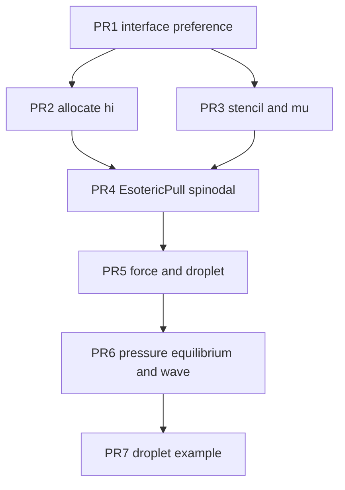

# Allen–Cahn interface preference

One Julia process is one interface method. The default process stays the sharp free surface. A second process, selected by a Preferences key, compiles conservative Allen–Cahn with both fluids colliding. Cahn–Hilliard and Navier–Stokes/Korteweg are reserved names and do not compile in this plan.

The base of this work is local `main` at `b8bb564` (“Fix even/odd temperature distribution.”), which is ahead of `origin/main` (`5d9b886`). Stack branches start from that commit, not from `origin/main`.

## Preference

`src/extensions.jl` already loads `dim` with `@load_preference` (lines 9–20) and sets `const SURFACE = true` (line 29). Add a second key the same way. Do not pass `disable_invalidation=true`. Do not read `ENV`.

```julia
_iface_pref = @load_preference("interface", "sharp")
const INTERFACE = Symbol(lowercase(String(_iface_pref)))
const ALLEN_CAHN = INTERFACE == :allen_cahn
const _SURFACE = true
const SURFACE = _SURFACE && !ALLEN_CAHN
```

Accepted values are only `"sharp"` and `"allen_cahn"`. `"cahn_hilliard"` and `"nsk"` throw `ErrorException` whose message says they are reserved and not compiled. Any other string throws too. Absent key means `"sharp"`.

`UPDATE_FIELDS = SURFACE` stays derived, so the Allen–Cahn image does not allocate or step the Körner mass ledger. `TEMPERATURE`, `TRT`, `KBC`, `FORCE_FIELD`, and `DIM` are unchanged. KBC is only called from the `SURFACE` collide body (`src/kernels/collide.jl` near line 621). With `SURFACE` false the live hydro body is `stream_collide_body!` under `@static if !SURFACE` (line 3), which uses `collide_pair` (TRT). Do not add KBC to that body.

Export `INTERFACE` and `ALLEN_CAHN` next to `SURFACE` in `src/LatticeBoltzmann.jl` line 13.

Two processes, same comment style as `dim`:

```julia
# using Preferences
# set_preferences!("LatticeBoltzmann", "interface" => "allen_cahn"; force=true)
# restart Julia. Delete LocalPreferences.toml (gitignored) to return to sharp.
```

`/LocalPreferences.toml` is already in `.gitignore`. Never commit that file. After any Allen–Cahn test process, delete it before the next sharp `Pkg.test`.

Sharp proof after every PR: no `LocalPreferences.toml` in the project, then the existing suite. `test/test_powder_bed.jl` errors without `input/powder_bed.h5`. That failure is pre-existing. Do not add the h5 and do not delete or weaken the test. A PR is green when that is the only failure.

## What the Allen–Cahn image computes

Every non-solid cell collides. There is no `TYPE_G` reconstruction and no `surface_0` / `surface_1` / `surface_2` / `surface_3`. Those kernels are already behind `@static if SURFACE` (`src/model.jl` `step!` and `initialize!`). Laser and powder stay inside `SURFACE && TEMPERATURE` (`src/model.jl` 678). The Allen–Cahn image does not call them.

The sharp fill fraction `domain.ϕ` (`src/domain.jl` 175–189) does not exist in this image, because `SURFACE` is false. The phase field is a new array `phi` and a new population slab `hi`, both allocated only under `@static if ALLEN_CAHN`. `hi` uses the hydro lattice (`:D3Q19` or `:D2Q9`), direction-major `f_index`, length `N * length(weights)`. \(c_s^2 = 1/3\).

EsotericPull is unchanged. `store` on parity \(P\) is what `load` on \(\lnot P\) reads (`src/kernels/helper.jl`). `hi` uses `load_pair`, `store_pair!`, and `load_bb_pair`. Init writes the even store with the \(+/-\) swap (`Val(false)`, `Val(true)`), the same correction `store_feq!` uses, so a uniform velocity keeps its sign. At rest \(h_+ = h_-\) and the swap does nothing. `n_hydro` is 1 in this image: the `Model` constructor throws if `ALLEN_CAHN && n_hydro != 1`. Both `fi` and `hi` then use `isodd(Int(domain.t))`.

### Phase field

Equilibrium profile, interface normal along \(s\), width \(W\):

\[
\phi(s) = \frac{1}{2}\left(1 + \tanh\frac{2s}{W}\right), \qquad
|\nabla\phi| = \frac{4}{W}\phi(1-\phi).
\]

Chemical potential (zero on that profile):

\[
\mu_\phi = \frac{3}{2}\sigma\left[\frac{16}{W}\phi(1-\phi)(1-2\phi) - W\nabla^2\phi\right].
\]

Capillary force, written into `domain.F` before the hydro collide. `domain.F` already exists (`src/domain.jl` 166–167). The `!SURFACE` collide adds it when `FORCE_FIELD` is true (`src/kernels/collide.jl` 30–31).

\[
\mathbf{F}_c = \mu_\phi\nabla\phi.
\]

Gravity stays the existing body force \(\mathbf{f}\), multiplied by the blended density over the reference density 1 when the two densities differ. At density ratio 1 this factor is 1.

Allen–Cahn populations, SRT, mobility \(M\):

\[
h_i^{\mathrm{eq}} = w_i\phi\left(1 + 3\mathbf{c}_i\cdot\mathbf{u}\right), \qquad
\omega_\phi = \frac{1}{3M + 1/2}.
\]

Sharpening flux, added after BGK, and zero when \(|\nabla\phi| < 10^{-8}\):

\[
\Delta h_i = 3 w_i\,\mathbf{c}_i\cdot\left[M\left(1 - \frac{4\phi(1-\phi)}{W|\nabla\phi|}\right)\nabla\phi\right].
\]

On the equilibrium profile the parenthesis is 0, so a tanh of width \(W\) does not move when \(\mathbf{u} = 0\).

Gradients are isotropic on the hydro stencil, periodic through `src_index`:

\[
\nabla\phi = 3\sum_i w_i\mathbf{c}_i\,\phi(n+\mathbf{c}_i), \qquad
\nabla^2\phi = 6\sum_{i\neq 0} w_i\left(\phi(n+\mathbf{c}_i) - \phi(n)\right).
\]

The sums skip the rest velocity. In 2D, \(c_z = 0\) and the same weights are the D2Q9 weights. Do not hard-code 19.

Bulk properties, used only when `ALLEN_CAHN`:

\[
\rho(\phi) = \rho_a + \phi(\rho_b - \rho_a), \qquad
\nu(\phi) = \nu_a + \phi(\nu_b - \nu_a).
\]

`ρ_a` is the \(\phi = 0\) fluid and `ρ_b` is the \(\phi = 1\) fluid. Default both densities to 1 and both viscosities to `domain.ν`. Keywords on `Model`: `W = 4`, `Mphi = 0.05`, `rho_a = 1`, `rho_b = 1`, `nu_a = nothing`, `nu_b = nothing` (`nothing` means `domain.ν`). `σ` is the existing surface-tension keyword.

### Hydro equilibrium

Through the static-droplet PR, hydro keeps today’s polynomial (`src/kernels/hydro.jl` `feq`):

\[
f_i^{\mathrm{eq}} = w_i\rho\left(1 + 3\mathbf{c}_i\cdot\mathbf{u} + 4.5(\mathbf{c}_i\cdot\mathbf{u})^2 - uu\right), \quad uu = 1.5|\mathbf{u}|^2.
\]

The pressure form lands only in the later PR, and only inside `@static if ALLEN_CAHN` in the `!SURFACE` collide. The non-Allen–Cahn `!SURFACE` path keeps `feq`. With \(p_h = \sum_i f_i\) and \(c_s^2 = 1/3\):

\[
f_i^{\mathrm{eq}} = w_i\left[p_h + \rho(\phi)\left(3\mathbf{c}_i\cdot\mathbf{u} + \frac{9}{2}(\mathbf{c}_i\cdot\mathbf{u})^2 - \frac{3}{2}|\mathbf{u}|^2\right)\right].
\]

Recover velocity from the first moment divided by \(\rho(\phi)\), not by \(p_h\). Clamp \(|\mathbf{u}|\) the way `prescribed_hydro` already clamps. `ω` for that cell comes from `ν(φ)`.

`TEMPERATURE` stays on. Isothermal tests set `β = 0` and do not assert `T`. Do not set `TEMPERATURE = false`.

## Step order in the Allen–Cahn image

`n_hydro` is 1. Inside `step!`, after the existing `SURFACE && TEMPERATURE` laser block (which is compiled out):

1. `grad_phi!` writes `∇φ` and `∇²φ` from the `phi` moment of the previous store.
2. Write `domain.F[n, :] = μ_φ ∇φ`. Add `domain.fx,fy,fz` scaled by `ρ(φ)` when densities differ. The hydro kernel still adds `domain.fx` itself (`fx` passed into collide). To avoid applying gravity twice, the Allen–Cahn image passes `fx = fy = fz = 0` into the hydro kernel and puts gravity only inside `domain.F`, multiplied by `ρ(φ)/1`. At density ratio 1 this matches today’s constant body force.
3. Hydro `stream_collide_*` on `t_odd = isodd(Int(domain.t))`.
4. `collide_phi!` on the same parity: `load_bb_pair` of `hi`, BGK to \(h_i^{\mathrm{eq}}\), add \(\Delta h_i\), `store_pair!`.
5. Write `phi[n] = Σ h_i` from the post-collide populations in the slots just stored, using the parity the next load would not use. Practical rule: reduce `phi` from the populations `collide_phi!` already holds in registers, before the store. Do not run a second kernel to rediscover them.
6. Existing temperature collide stays inside the hydro kernel on this single substep. `increment_time_step!` stays where it is.

Walls: `TYPE_S` still returns before hydro collide. `load_bb_pair` reflects `hi` at a solid neighbor (zero normal flux). The acceptance tests are periodic, so they do not depend on wetting. No contact angle.

## Tests

| Test | Process | Assert |
|---|---|---|
| `test/test_interface_pref.jl` | sharp, always included | `INTERFACE == :sharp`, `ALLEN_CAHN == false`, `SURFACE == true` |
| `test/test_allen_cahn_stencil.jl` | both | On `φ = (1+tanh(2z/W))/2` with `W = 4`, periodic, `μ` max abs `< 1e-3` away from the two cells where the periodic image of the interface meets itself. `\|∇φ\|` matches `4φ(1-φ)/W` within `1e-3` at the mid-interface cell. |
| `test/test_allen_cahn_spinodal.jl` | `ALLEN_CAHN` only | Periodic box, `u = 0`, `σ = 0.01`, `W = 4`, `Mphi = 0.05`, densities 1. Initial `φ` is a tanh of width `2W`. After 400 steps the mid-interface `\|∇φ\|` is within 5% of `4φ(1-φ)/W`, the center of `φ = 0.5` has not moved by more than 0.5 cell, all `hi` finite. |
| `test/test_allen_cahn_droplet.jl` | `ALLEN_CAHN` only | `32³` too slow; use `24×8×24`, droplet radius 6 along x–z, uniform in y, `σ = 1e-3`, `W = 4`, `ν = 0.05`, densities 1, `β = 0`, body force 0. 800 steps. `Δp = p_in − p_out` within 20% of `σ/R` (cylinder along y, not a sphere). `maximum(|u|) < 5e-3`. Finite. |
| `test/test_allen_cahn_wave.jl` | `ALLEN_CAHN` only | `32×4×32`, `ρ_a = 1`, `ρ_b = 2`, `ν = 0.01`, `σ = 0.01`, `W = 4`. Interface `z = Nz/2 + sin(2π x/Nx)`. 1500 steps, CPU, `workgroup = 64`. Populations finite. Inviscid two-fluid frequency `ω² = σ k³ / (ρ_a+ρ_b)` with `k = 2π/Nx`. The measured `φ = 0.5` height at `x = 1` changes sign relative to its start, or its first return to the start height, inside `0.7 T` to `1.5 T` with `T = 2π/ω`. |

`p = Σ_i f_i / 3` while the polynomial `feq` is still in use (droplet). After the pressure equilibrium, `p_h = Σ_i f_i` and the jump is in `p_h`. The droplet PR is before that change, so it uses `ρ/3`. The wave PR uses `p_h`.

Stencil and preference tests are included from `test/runtests.jl` with no `@static`. Spinodal, droplet, and wave includes sit inside `@static if ALLEN_CAHN`.

Allen–Cahn proof command, from the package directory, after the sharp suite and after deleting any preference file:

```julia
using Preferences
set_preferences!("LatticeBoltzmann", "interface" => "allen_cahn"; force=true)
```

Restart the process, then `include` the Allen–Cahn test files. Delete `LocalPreferences.toml` afterwards. Do not leave it in the tree.

## Out of scope

Central moments, a composition field, volumetric phase change, Cahn–Hilliard, Navier–Stokes/Korteweg, surfactant, a second phase field, contact angle, and laser or powder on the diffuse interface. Do not edit `examples/melt_pool.jl`, `examples/DED.jl`, `examples/LPBF.jl`, or the sharp surface kernels except to keep them behind `SURFACE`.

## PR Plan

Each PR leaves the sharp process green apart from the pre-existing missing powder-bed file. Allen–Cahn `step!` tests are not compiled into the sharp process.



### PR 1: Compile-time interface preference

- **Files/components affected:** `src/extensions.jl`, `src/LatticeBoltzmann.jl`, `test/test_interface_pref.jl`, `test/runtests.jl`
- **Dependencies:** None
- **Description:** Add the `interface` preference, `INTERFACE`, `ALLEN_CAHN`, and `SURFACE = _SURFACE && !ALLEN_CAHN` as specified in Preference. Export `INTERFACE` and `ALLEN_CAHN`. Comment the two-process recipe. Do not pass `disable_invalidation`. Do not edit kernels, `domain.jl`, or `model.jl`. Include `test/test_interface_pref.jl` from `runtests.jl` with no `@static`. The test asserts `INTERFACE == :sharp`, `ALLEN_CAHN == false`, and `SURFACE == true`. Sharp suite stays green except the pre-existing missing `input/powder_bed.h5`.

### PR 2: Allocate the phase field only in the Allen–Cahn image

- **Files/components affected:** `src/domain.jl`, `src/model.jl`, `test/test_allen_cahn_alloc.jl`, `test/runtests.jl`
- **Dependencies:** PR 1
- **Description:** Under `@static if ALLEN_CAHN` only, add `hi` (`N * nvel`), `phi` (`N`), and scalar parameters `W`, `Mphi`, `rho_a`, `rho_b`, `nu_a`, `nu_b` on `Domain`. Thread `Model` keywords `W = 4`, `Mphi = 0.05`, `rho_a = 1`, `rho_b = 1`, `nu_a = nothing`, `nu_b = nothing`. `nothing` stores `domain.ν`. If `ALLEN_CAHN && n_hydro != 1`, throw. `@info` the interface name next to the existing dimension log. Do not allocate these fields in the sharp image. Do not change sharp `Model` positional arguments. Include `test/test_allen_cahn_alloc.jl` only inside `@static if ALLEN_CAHN`: `Model(8,8,8,0.05; backend=CPU(), workgroup=64)` has `length(hi) == 8*8*8*19` when `DIM == 3` and `*9` when `DIM == 2`, `length(phi) == N`, and `Model(..., n_hydro=2)` throws. Sharp `Pkg.test` does not construct `hi`. No collide and no `step!` in this PR.

### PR 3: Isotropic gradient, Laplacian, and chemical potential

- **Files/components affected:** `src/kernels/allen_cahn.jl`, `src/LatticeBoltzmann.jl`, `test/test_allen_cahn_stencil.jl`, `test/runtests.jl`
- **Dependencies:** PR 1
- **Description:** New `src/kernels/allen_cahn.jl`, included from `src/LatticeBoltzmann.jl` after `kernels/helper.jl`. Pure functions, compiled in both images: periodic `grad_phi` and `laplacian_phi` with the hydro weights and `src_index`, and `mu_phi(phi, lap, σ, W)` implementing the chemical-potential formula in What the Allen–Cahn image computes. No population kernel and no `Domain` field. Include `test/test_allen_cahn_stencil.jl` from `runtests.jl` with no `@static`, so the sharp process runs it. Build a periodic `φ = (1+tanh(2s/W))/2` with `W = 4` on a grid of at least 8 cells in the interface direction and one cell in the others (`Nz` is 1 only when `DIM == 2`). Assert the mid-interface gradient magnitude and a near-zero `μ` as in the Tests table. Do not `step!`.

### PR 4: EsotericPull of hi and the stationary tanh

- **Files/components affected:** `src/kernels/allen_cahn.jl`, `src/kernels/init.jl`, `src/model.jl`, `test/test_allen_cahn_spinodal.jl`, `test/runtests.jl`
- **Dependencies:** PR 2, PR 3
- **Description:** `collide_phi!` and an even/odd kernel pair. Load `hi` with `load_bb_pair`, BGK toward `h_i^eq = w_i φ (1 + 3 c·u)` at `ω_φ = 1/(3 Mphi + 1/2)`, add the sharpening `Δh_i` from the Model section, store with `store_pair!` on the current parity. Reduce `phi` from the post-collide registers. Init under `@static if ALLEN_CAHN`: if the cell is not `TYPE_S`, write `h_i^eq` from the current `phi` and `u` with the even store and the \(+/-\) swap (`Val(false)`, `Val(true)`). Solids write the rest equilibrium at `u = 0` the same way. Call this from `initialize!` after the existing kernel. In `step!`, under `@static if ALLEN_CAHN`, run `collide_phi!` once per outer step on `isodd(Int(domain.t))` before `increment_time_step!`. Do not run it on a hydro substep index. Pass `fx = fy = fz = 0` into hydro only in this image and write gravity into `domain.F` in PR 5; this PR has zero force and `u = 0`. Include `test/test_allen_cahn_spinodal.jl` only when `ALLEN_CAHN`. The case is the spinodal row of the Tests table. Run it in a second process with `interface => allen_cahn`, then delete `LocalPreferences.toml`. Sharp `Pkg.test` must still pass aside from the missing h5.

### PR 5: Capillary force and a static cylinder

- **Files/components affected:** `src/kernels/allen_cahn.jl`, `src/model.jl`, `test/test_allen_cahn_droplet.jl`, `test/runtests.jl`
- **Dependencies:** PR 4
- **Description:** Before the hydro kernel, under `@static if ALLEN_CAHN`, compute `∇φ` and `∇²φ` from `phi`, then `domain.F = μ_φ ∇φ`. Multiply the existing body acceleration by `ρ(φ)` and store that in `domain.F` as well. Hydro collide receives `fx = fy = fz = 0` in this image so gravity is not added a second time. Density ratio is 1 in this PR, so `ρ(φ) = 1` and `feq` is still the polynomial in `src/kernels/hydro.jl`. Do not change that polynomial here. Include `test/test_allen_cahn_droplet.jl` only when `ALLEN_CAHN`, matching the droplet row of the Tests table (`Δp = ρ/3` inside minus outside, cylinder curvature `σ/R`, `maximum(|u|) < 5e-3`). Second process, then delete `LocalPreferences.toml`.

### PR 6: Blended density, pressure equilibrium, capillary wave

- **Files/components affected:** `src/kernels/collide.jl`, `src/kernels/hydro.jl`, `src/model.jl`, `test/test_allen_cahn_wave.jl`, `test/runtests.jl`
- **Dependencies:** PR 5
- **Description:** Only inside the `!SURFACE` collide body, and only under `@static if ALLEN_CAHN`, replace the polynomial equilibrium with the pressure form in Hydro equilibrium. `p_h = Σ f_i` before the shift from `domain.F`. Velocity is the first moment divided by `ρ(φ)`. `ω` comes from `ν(φ)`. The `!ALLEN_CAHN` arm of that body keeps `feq` verbatim. The `SURFACE` collide body is not edited. `grad` / force kernel reads `rho_a` and `rho_b` so `F` uses `ρ(φ)`. Include `test/test_allen_cahn_wave.jl` only when `ALLEN_CAHN`, matching the wave row of the Tests table. The droplet test still passes at density ratio 1 with the pressure form (`p_h` jump within 20% of `σ/R`). Second process, then delete `LocalPreferences.toml`. Sharp `Pkg.test` does not compile this body.

### PR 7: Allen–Cahn droplet example

- **Files/components affected:** `examples/allen_cahn_droplet.jl`
- **Dependencies:** PR 6
- **Description:** One new example. It `@assert`s `ALLEN_CAHN` and tells the reader to set the `interface` preference and restart. CPU, `24×8×24`, the same cylinder as the droplet test, 200 steps, prints `Δp` and `maximum(|u|)`. No VTK. Do not edit any other example. Do not set the preference from the script.
