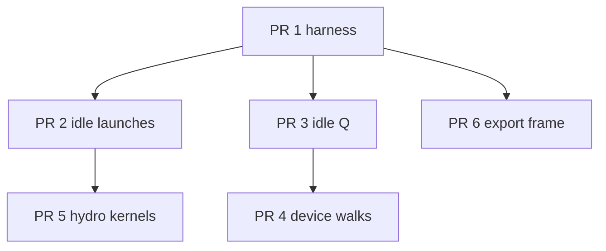

# GPU performance plan — feature-heavy Tim DED

Assessment of `step!` as it is on disk, and a PR DAG to get that time back on the GPU. The case that matters is `examples/Tim_DED.jl`: free surface, PLIC, Fresnel multi-bounce laser, evaporation, recoil, radiation, Marangoni, gravity, in-flight powder heating, three powder jets, and VTK. This document is the plan only. It does not change the solver.

Line numbers are from the tree this plan was written against. Re-read the function before editing it.

Streaming in this code is EsotericPull: one population array, even and odd slots. `run!` reports MLUPS as `get_N(model) / wall time of one outer step!` (`src/model.jl` 605–610). That one call includes every hydro substep and the host powder and laser work. It does not include `export!`.

`examples/workgroup_bench.jl` is a different measurement. It times a 128³ melt-pool step with `n_hydro = 1` and no laser or powder. Leave it as the workgroup sweep. The harness in PR 1 is the feature-path measurement.

## What one outer step does

`step!` (`src/model.jl` 663–789) loops domains, then does two stages.

**Once per outer step**, when `SURFACE && TEMPERATURE` (689–698):

1. `heat_powder_beam!` — host, parcels only.
2. `deposit_laser!` — host DDA, and only when `laser_deposits_now` is true.
3. `advance_powder_jet!` — host, full-grid copies when any jet is on or a debit is outstanding.
4. `powder_gas_kernel!` if `τ_p > 0`. This kernel is built inside `step!` (694). Every other kernel is cached when the `Model` is constructed (229–255).

**Then `n_hydro` substeps** (704–784). Each substep launches, in this order:

1. `surface_0` (even or odd from the hydro parity)
2. `update_moving_boundaries_kernel!`
3. `stream_collide` (even or odd)
4. `surface_1`
5. `surface_2` (even or odd)
6. `surface_3`

`do_thermal` is true only on the last substep (`thermal = sub == nsub`, line 707). One `KernelAbstractions.synchronize` runs after the domain loop (789).

Parity stays as written and is part of the physics of EsotericPull:

- Hydro parity advances every substep: `t_odd = isodd(t * n_hydro + sub - 1)` (706).
- Thermal parity is once per outer step: `g_odd = isodd(t)` (703).
- A birth before the thermal collide is stored for `load(g_odd)`. A birth on an earlier substep is stored for `load(!g_odd)`: `g_store_odd = thermal ? g_odd : !g_odd` (712).

Flags that are compiled in (`src/extensions.jl` 26–34) are all true: `TRT`, `KBC`, `SURFACE`, `VOLUME_FORCE`, `EQUILIBRIUM_BOUNDARIES`, `MOVING_BOUNDARIES`, `FORCE_FIELD`, `TEMPERATURE`. `APPLY_FORCE` is true. Tim does not have a smaller kernel hiding behind a flag. Gas and solid return at the start of the surface collide (`src/kernels/collide.jl` 464–466) and at the start of `surface_0` (`src/kernels/surface.jl` 33). The plate is `TYPE_F` and still collides. Empty flag 0 is gas under `SURFACE`.

## Why Tim pays this on every step

`examples/Tim_DED.jl` builds one CUDA model of the 12.8 × 6.4 × 3.2 mm plate at 80 µm, so the grid is on the order of 160 × 80 × 100 (header, lines 10–12). `N` is printed on the info line (204). Walls are `TYPE_S` with velocity left at zero.

Hydro substeps exist so the physical surface tension stays inside the lattice cap. Coefficients on `Domain` are for one outer step. A hydro substep uses `Δt / n_hydro`:

\[
\nu_\text{sub} = \nu / n_\text{hydro}, \qquad
\sigma_\text{sub} = \sigma / n_\text{hydro}^2, \qquad
\mathbf{g}_\text{sub} = \mathbf{g} / n_\text{hydro}^2, \qquad
p_{0v,\text{sub}} = p_{0v} / n_\text{hydro}^2
\]

Hertz–Knudsen runs only on the last substep, and \(p\) above is already the substep value, so the call scales the coefficient the other way: `C_hk_sub = C_hk * n_hydro²` (`src/model.jl` 671–687). Tim sets

```julia
n_hydro = max(1, ceil(Int, sqrt(max(σ_lat_phys, 0.0) / Float64(σ_lat_cap))))
```

with `σ_lat_cap = 0.03` (`examples/Tim_DED.jl` 66–67 and 143–147). For a lattice σ of several units this is on the order of fifteen substeps. The live integer is whatever the info line prints. The harness records that integer. Shortening `n_hydro` to go faster changes σ, recoil pressure, gravity, and the Hertz–Knudsen product. It is not a performance PR.

Launch count with the surface flags on is `6 * n_hydro + 1` (the powder-gas kernel) per outer step. At fifteen substeps that is about ninety kernel launches, then the host copies.

The laser bundle is a square of side

```julia
nrays = max(11, ceil(Int, 4 * w_cells / 0.5))
```

(`examples/Tim_DED.jl` 175–177), and `_build_ray_bundle` keeps a ray when its power exceeds `1e-8 * P` (`src/laser.jl` 46–63). The 1.0 mm spot has radius 0.5 mm. At 80 µm that radius is 6.25 cells, the side count is 50, and the bundle holds at most 2500 rays. Deposit runs when `t == 0` or `t % every == 0`, with `every = qevery = max(1, round(Int, 0.25 / v_lat))` (`src/laser.jl` 478–483, `examples/Tim_DED.jl` 192 and 234). Steps in between keep the previous `Q`. The harness prints `Laser.every` from the model it builds.

`examples/Tim_DED.jl` times `run!(model, 1)` (301–306) and calls `export!` plus four `Array` copies only inside `report!`, every `every` steps (257–261, 309). A slow frame does not move the printed MLUPS. Wall time of a full track still includes those frames.

## Where the time goes

No GPU profile has been recorded for this tree. The ranking below is a reading of the copies and the launches. PR 1 is what confirms it or overturns it. Later PRs do not start until that table exists.

Arithmetic for a grid of about \(N = 1.3 \times 10^6\) cells, not a measured time:

| Path | When | Bytes moved, order of magnitude |
| --- | --- | --- |
| `advance_powder_jet!` D2H of `flags`, `ϕ`, `mp`, `mass`, `T`, `fs`, `ρ` | every outer step while a jet is on or a debit is outstanding (`src/powder.jl` 658–664) | ~25 B/cell, ~30 MB |
| same function H2D of `mp`, `mass`, `Q` (701–703) | same | ~12 B/cell, ~15 MB |
| idle `qhold` round-trip of `Q` (632, 647) | every later step after `qhold` has been resized, even with powder off and no live parcel | ~8 B/cell, ~10 MB |
| `deposit_laser!` D2H of `flags` and `ϕ`, H2D of `Q` (`src/laser.jl` 535–548) | each deposit step | ~10 MB plus a serial walk of up to 2500 rays |
| `heat_powder_beam!` (`src/powder.jl` 548–611) | deposit steps | parcels only, no grid copy |
| `trace_laser_rays` plus two more `flags` downloads (`src/export.jl` 396, 427, 454) | an export frame | one ray retrace and three flag copies, outside `step!` |

`Array` on a CUDA array synchronizes. Those copies sit on the critical path of the MLUPS timer.

The idle debit is a host-side bug as well as a copy. `restore` is `!refreshed && !isempty(J.qhold)` (`src/powder.jl` 624–628). The first resize sets `length(qhold) == N` forever, including when every entry is zero. A disabled jet with no live parcel still downloads `Q`, adds zeros, and uploads `Q`.

The moving-boundary kernel (`src/kernels/moments.jl` 132–157) runs on every substep. For every cell that is not `TYPE_S` or `TYPE_E` it walks all 18 neighbors and ORs `TYPE_MS` when a solid neighbor has nonzero `u`. Tim's solids have `u = 0`, so the kernel only clears a bit that is already clear. That is a full-grid neighbor read, `n_hydro` times per outer step, not just a launch. Skipping it is legal only while no solid velocity is live. Fusing it into `surface_0` is not legal: `surface_0` reads flags, and this kernel writes `TYPE_MS` on neighbors.

The collide kernel is one specialization for both substep kinds. `do_thermal::Bool` is a runtime argument (`src/kernels/collide.jl` 460 and 711). KernelAbstractions specializes on types, so both arms stay in the compiled kernel:

- Thermal arm (517–570): powder enthalpy mix, then `collide_temperature!` (D3Q7, phase change, evaporation, radiation), then the evaporative mass debit.
- Hydro arm (571–577): Boussinesq only, `f -= f_body * β * (T - T_avg)`.

Still outside that branch, on every substep: Marangoni (579–584), the liquid-interface viscosity floor `ν ≥ 0.05` (587–594), Darcy (595–600), the liquid-interface speed cap `|u| ≤ 0.2` (602–618), the Guo half-force shift (620–624), and `kbc_store!` (669–671). A hydro-only specialization drops `collide_temperature!` and the powder mix from fourteen of the fifteen launches. It does not drop KBC, Marangoni, the viscosity floor, or the speed cap. Those stay on every substep, in both specializations, exactly where they are now.

`surface_0` has the same runtime `Bool`. Its thermal arm is only the adiabatic and boundary reconstruction of `gi` (`src/kernels/surface.jl` 77–83). Mass exchange, PLIC capillary density, recoil, and Marangoni in that function run every substep and stay in the hydro specialization.

## Kernels that stay separate launches

A GPU launch has no grid-wide barrier. These pairs read and write the same neighbor slots, so they stay six launches per substep.

| Pair | Why a fused kernel is wrong |
| --- | --- |
| `surface_0` then collide | `surface_0` reads pre-collide populations with `load_bb_pair` / `load_outgoing_pair` (`src/kernels/surface.jl` 70–71). Collide writes the post-collide pair into the neighbor slot with `store_pair!` (`src/kernels/collide.jl` 698) or `kbc_store!` (670). |
| moving-boundary kernel then collide | The kernel writes `TYPE_MS` (`src/kernels/moments.jl` 154). Collide reads it in `moving_wall_pair` (`src/kernels/collide.jl` 490). `surface_0` has already read flags. |
| `surface_1` then `surface_2` | `surface_1` publishes `TYPE_GI` / `TYPE_I` onto neighbors (`src/kernels/surface.jl` 694, 724). `surface_2` reads those flags (796). |
| `surface_2` then `surface_3` | `surface_2` reads neighbor flags and writes some of them (796–800). `surface_3` reads neighbor flags through `has_gas_neighbor` / `publish_surplus` and writes `flags[n]` (846–886). |

Order inside the substep stays: `surface_0`, moving boundaries, collide, `surface_1`, `surface_2`, `surface_3`.

## Physics that stays as it is

A faster kernel that changes these is a failed PR.

- `n_hydro` stays on the σ formula. `σ`, `g`, and `p0v` stay divided by `n_hydro²`. `C_hk` stays multiplied by `n_hydro²`. `ν` stays divided by `n_hydro`.
- KBC stays the hydro collision. The split in PR 5 is two specializations of the same body, not a switch back to TRT.
- Recoil uses `recoil_has_bulk`. The Anisimov cap and the recoil `Δρ` cap stay. Evaporative unpin stays.
- Liquid `TYPE_I` keeps `ν ≥ 0.05` and the stored-velocity cap `|u| ≤ 0.2` (the stored `u` is the Guo half-force value). There is no extra global speed cap below \(c_s\).
- The `|f| > 2` population bound stays.
- Interface birth stays half a cell: `birth + 1e-4 * ρ >= 0.5 * ρ`, and surplus stays on the donor until `publish_surplus` says the leading face outranks the metal already in front.
- Gas-face reconstruction stays adiabatic, and the normal speed on that face stays zero.
- Laser hits stay: PLIC in-metal at `ϕ = 1`, the zero-normal full-cell hit, the `TYPE_F` Fresnel-skin fallback, multi-bounce, and the skin count. `Pray` is not rewritten. Deposit and trace scale by `powder_beam_transmit`.
- Powder: the given feed is the total. One jet keeps that rate. `n` jets each get `mdot / n`. The shadow cap is the sum of the raw shadows, scaled once so the sum is at most `P`. Landings share the first jet's `qhold`. In-flight heating stays optically thin, stops at `T_v`, and still shades the wall after that. Particle sizes stay the d10/d50/d90 set in `input/DED_powder.jl`.
- Tim's three nozzles stay at 30° from vertical, azimuths 90° / 210° / 330°, each aimed at the laser focus. `examples/DED.jl` stays the single coaxial jet. `melt_pool.jl` and `LPBF.jl` stay on one `PowderJet`.
- Process numbers stay 726 W, 1.0 mm spot, 500 mm/min, 9.5 g/min. IN625 `si_Lv` and 316L `si_Lv` stay. VTK temperature clamp stays `[0, 20000]` K.
- Gas cells are not dropped from the launch grid. The early return is the occupancy tool we already have.
- Foam, Allen–Cahn, multi-material, and the Saclay notes are untouched.

## Verification

Every solver PR re-runs the PR 1 harness on the CUDA backend and keeps the physics guards. The number that must move is the clock-off median milliseconds per outer step, same definition as `run!`: one `step!`, all substeps, no `export!`.

The clock-on phase table inserts a synchronize around each phase so the times add up. That table is attribution. It is slower than the real step, and it is not the gate.

The harness does not `include` `examples/Tim_DED.jl` and does not write `output_Tim_DED` or `output_Tim_DED_verify`. One `julia --project=.` at a time. No `LocalPreferences.toml`. No HDF5 powder-bed test. No full `test/test_temperature.jl` except the testsets a PR names. A top-level `@testset` failure aborts the rest of that file, so targeted drivers include one testset.

Guards on the harness, after the timed steps:

- every sampled `T` finite and `≥ 0`
- `umax < 0.9`
- mass and the population sum finite
- metal mass stays within the injected powder plus a relative tolerance the bench header states

The full-track failure lines (`zI ≥ 95`, `Tmax > 4000` K, `Tmin < 0`, `umax ≥ 0.9`) belong to a future Tim run. They are not the harness gate. This plan does not start that run.

Absolute MLUPS is machine-specific. The bench prints it and does not `@test` a threshold. A PR that retunes the bench parameters to look faster has not sped up the solver.

If `CUDA.functional()` is false the bench exits 0 with that sentence. No speedup is claimed from a CPU run.

## PR Plan

### PR 1: CUDA feature-path timing harness

- **Files/components affected:** examples/gpu_feature_bench.jl, src/model.jl
- **Dependencies:** None
- **Description:** Add a CUDA harness and a phase clock on `step!` that is off unless the harness sets it. Clock-off reports median ms/step and MLUPS for a small feature grid and for a Tim-shaped grid, both with `n_hydro` fixed at the Tim count, three jets, and the laser on. A second configuration on the small grid has `n_hydro = 1`, laser off, and powder off. Clock-on reports host powder/laser, powder-gas, surface_0, moving boundaries, collide, and surface_1/2/3 separately. Physics guards fail the process. MLUPS is printed, not asserted. The bench builds its own model and does not touch `output_Tim_DED`. Default workgroup stays 256. Record the table in the PR text. That table is the baseline later PRs compare against.

The clock is a host vector on the model, `nothing` by default. Production `step!` does not add synchronizes when it is `nothing`. When it is set, `step!` synchronizes around the host powder/laser block, the powder-gas launch, and each of the six substep kernels, and accumulates nanoseconds. `run!` is unchanged.

Feature grid: `64 × 32 × 48` (98_304 cells, divisible by 256). Tim-shaped grid: `160 × 80 × 96` (1_228_800 cells, divisible by 256), warmup 2, timed 5. Small grid: warmup 8, timed 20. `n_hydro = 15` on both feature configs, passed in explicitly so the launch count matches Tim without depending on `σ_lat_phys`. Three jets, `nparcels = 8`, laser `every = 1` for one series and `every = 4` for a second series on the small grid. Mild lattice coefficients, written as constants at the top of the bench, chosen so the guards hold. Later PRs use those constants unchanged.

Plate interior `TYPE_F`, gas above, `TYPE_S` walls, solid velocity zero. Evaporation, recoil, radiation, Marangoni, and surface tension coefficients are nonzero so the thermal arm and the PLIC arm are live in the specialized code. They do not have to boil the pool in twenty steps.

Print, every run: device name, `Nx Ny Nz N`, `n_hydro`, ray count, `Laser.every`, workgroup, clock-off median ms and MLUPS, clock-on phase medians, `Tmin Tmax umax`, mass.

Run:

```bash
julia --project=. examples/gpu_feature_bench.jl
```

### PR 2: Drop idle full-grid launches

- **Files/components affected:** src/model.jl, src/kernels/moments.jl, test/test_moving.jl
- **Dependencies:** PR 1
- **Description:** Skip `update_moving_boundaries_kernel!` for the whole run when a sticky flag says no solid has nonzero velocity, and cache `powder_gas_kernel!` on the model the same way the collide kernels are cached. Tim's walls qualify for the skip. A case that sets a solid velocity still runs today's kernel and still sets `TYPE_MS`. Re-run the harness. The moving-boundary phase on the feature config goes to zero. The `n_hydro = 1` configuration must not get slower.

The sticky flag is computed once at `initialize!` by a device reduction over solid cells, not by downloading `u` every step. A setter used by the moving-wall tests sets the flag and keeps the kernel in the substep. Direct writes of solid `u` that bypass the setter are documented in one comment on the setter. The first step after a solid stops still runs the kernel once so `TYPE_MS` is cleared, then the flag drops.

`powder_gas_kernel!` is constructed next to the other cached kernels (`src/model.jl` 229–255) and launched from the cache. The `τ_p > 0` guard stays. No change to the gas-powder feed or decay.

Tests: existing moving-boundary tests pass with the flag set. One assertion covers a static plate: after `initialize!` the flag is false and a short `step!` does not require `TYPE_MS` to appear. Harness guards hold.

### PR 3: Stop the idle powder Q round-trip

- **Files/components affected:** src/powder.jl, test/test_temperature.jl
- **Dependencies:** PR 1
- **Description:** `advance_powder_jet!` treats a debit as outstanding only when some `qhold` entry is nonzero. A zero buffer of length `N` is not a restore, so a disabled jet with no live parcel returns before `Array` of `Q`. An outstanding nonzero debit is still added back on a non-deposit step. Single-jet numbers and the three-jet shared debit stay. Re-run the harness with powder disabled after one deposit and record the host-phase drop.

Implementation is a host `qhold_dirty` bit set when the walk writes a nonzero debit and cleared when that debit is restored. `restore` becomes `!refreshed && qhold_dirty`. The length check that resizes `qhold` stays. `heat_powder_beam!` is unchanged and stays on the host: it never copies the grid.

Tests to run, as one targeted driver rather than the whole temperature file: the powder ring testset and a new case that disables the jet, empties the parcels, takes one step that allocates `qhold`, and checks the following step does not change `Q`. Deposit, enthalpy mix, and the shadow cap stay covered by the existing powder tests. A jet that deposits onto `Q` and is then disabled still restores that debit once.

### PR 4: Run the laser and powder walks on the device

- **Files/components affected:** src/laser.jl, src/powder.jl, src/kernels/laser.jl, src/kernels/powder.jl
- **Dependencies:** PR 3
- **Description:** Move the laser DDA and the parcel walk into KernelAbstractions kernels launched from `deposit_laser!` and `advance_powder_jet!`, so `step!` no longer downloads `flags`, `ϕ`, `ρ`, `T`, `fs`, `mp`, `mass`, or `Q` on those paths. Keep the Fresnel walk, the skin, multi-bounce, the shadow cap, and the shared `qhold`. `heat_powder_beam!` and `trace_laser_rays` stay on the host. `trace_laser_rays` runs only from export. Re-run the harness. The clock-off feature step is the gate.

`step!` keeps the call order: heat, deposit, advance, powder-gas, then the hydro substeps. The new kernels use the same backend queue, so that order is the stream order. No extra full-grid synchronize in the middle of `step!`.

Laser kernel: one thread per ray, reading device `flags` and `ϕ`, scattering with a float atomic add into `Q`. Ray offsets and `Pray` are copied to the device when the bundle is built, not every step. `Q` is zeroed on the device, then the rays run, and only on a deposit step. `powder_beam_transmit` still scales the walk. `Pray` is not rewritten. Hits that must survive bit-for-bit in tests: `ϕ = 1` PLIC in-metal, the zero-normal full-cell hit, the `TYPE_F` Fresnel-skin fallback.

Powder kernel: one thread per parcel slot across the jet list. Atomics into `mp`, `mass`, `Q`, and the first jet's `qhold`. Disabled jets do not spawn and still fly live parcels. PR 3's dirty bit becomes a single device integer set when a nonzero debit is written. The host reads that one integer, not the grid. The idle return in PR 3 stays in front of any launch.

CPU tests call the same kernels through KernelAbstractions. Two parcels that land in one cell may differ in the last bits of a `Float32` atomic sum. Integral mass and integral deposited energy stay within a relative tolerance stated in the test. Tests of a single parcel landing in its own cell keep a tight tolerance. Do not loosen the Fresnel, hit-cell, feed-split, or shadow-cap assertions.

Harness: feature config, powder on, both `every = 1` and `every = 4`. Guards hold. Compare clock-off median ms/step to the PR 1 table on the same GPU. Also confirm the powder-off series from PR 3 still skips the copy.

### PR 5: Specialize the hydro substep kernels

- **Files/components affected:** src/kernels/collide.jl, src/kernels/surface.jl, src/model.jl
- **Dependencies:** PR 2
- **Description:** Compile `do_thermal` as `Val{true}` and `Val{false}` for the surface collide and for `surface_0`, even and odd. Substeps before the last launch the hydro specialization. The last substep launches the thermal specialization. KBC, Marangoni, the viscosity floor, the interface speed cap, Darcy, and the hydro-arm Boussinesq stay on every substep. `collide_temperature!` and the powder enthalpy mix run only on the thermal specialization. Parity and `g_store_odd` are unchanged. Re-run the harness, including the workgroup sweep on the feature config.

Cache four collide kernels and four `surface_0` kernels (even/odd × hydro/thermal) next to the existing cache. The body stays one function so the equations are not forked. `Val{false}` contains the Boussinesq `else` arm (collide.jl 571–577) and everything that is already outside `if do_thermal`. `Val{true}` contains the thermal arm (517–570) plus those same outside lines. Dropping the Boussinesq arm from hydro substeps, or running the viscosity floor only on the last substep, changes the flow.

`surface_0`'s `Val{true}` arm is the `gi` reconstruction (surface.jl 77–83). Mass, PLIC, recoil, and Marangoni in `surface_0` stay on `Val{false}` as well.

After the split, sweep workgroups `(128, 256, 512)` on the small feature config, clock off. Change `default_workgroup(::CUDABackend)` only if 128 or 512 beats 256 on that config by a margin the PR text shows, and the `n_hydro = 1` config does not regress. Otherwise leave 256.

Populations on a short CPU run of a single-phase channel and of a free-surface step match the pre-split result within a documented `Float32` tolerance. The thermal last-substep still books evaporation and radiation once per outer step. Harness guards hold. Compare collide phase time and clock-off ms/step to the PR 1 table.

### PR 6: One flag download per export frame

- **Files/components affected:** src/export.jl, examples/gpu_feature_bench.jl
- **Dependencies:** PR 1
- **Description:** An export frame downloads `flags` once and reuses that array for the laser retrace, the beam cylinder, and the powder cylinders. Volume VTK stays on the existing async CUDA path. The temperature clamp is unchanged. The harness gains a separate ms/frame number for one `export!`, reported beside MLUPS and not added into it. Re-run the harness. Clock-off step time stays at least as good as PR 1.

Today `_write_laser_rays` downloads `flags` and `ϕ` inside `trace_laser_rays`, then downloads `flags` again for the beam cylinder (`src/export.jl` 396 and 427). `_write_powder_jet` downloads `flags` a third time (454). Pass one downloaded `flags` into the cylinder writers. `trace_laser_rays` still needs `ϕ`. That is the remaining per-frame pair, and it stays off the `step!` path.

Async volume copy stays gated on `CUDABackend`, `CUDA.functional()`, and `Threads.nthreads() >= 2` (`src/export.jl` 548). The frame timer in the harness runs with `-t2` so that gate is open, and prints whether the async path was taken. Rays stay polylines in `rays.pvd`. The beam cylinder stays in `beam.pvd`. Powder stays one cylinder per enabled jet in `powder.pvd`.

`track_metrics` in `examples/Tim_DED.jl` downloads `fs`, `flags`, `T`, and `u` inside `report!`, which is already on the export cadence. Leave that example copy alone in this PR. It is outside `step!` and outside the MLUPS number.

## Stack



Levels: PR 1, then PR 2 and PR 3 and PR 6 together, then PR 4 and PR 5 together. PR 4 and PR 5 touch different files. PR 5 touches `step!` only after PR 2's skip is already in that function. PR 4 stays inside `deposit_laser!` and `advance_powder_jet!` and does not edit the substep loop.

Linear stack order for a later execute-plan run: PR 1, PR 2, PR 3, PR 6, PR 4, PR 5.

## Decision the baseline is allowed to overturn

If the PR 1 clock-on table shows the collide phase dominating the host copies on the Tim-shaped grid, do PR 5 before spending time on the device walks, and say so in the PR 5 text. The DAG edges do not change: PR 5 does not depend on PR 4. If the moving-boundary phase is already noise next to collide, PR 2 still lands, because a full-grid neighbor walk on a static plate is wasted work, and the expected gain is small. If the idle `Q` round-trip is invisible while powder is on, PR 3 still lands: the round-trip is real for the steps after the jets turn off, which is the freeze tail of Tim.

What the baseline must not overturn: fusing the six substep kernels, lowering `n_hydro`, turning KBC off, coarsening the ray bundle, compacting gas cells out of the grid, or relaxing the physics list above.
